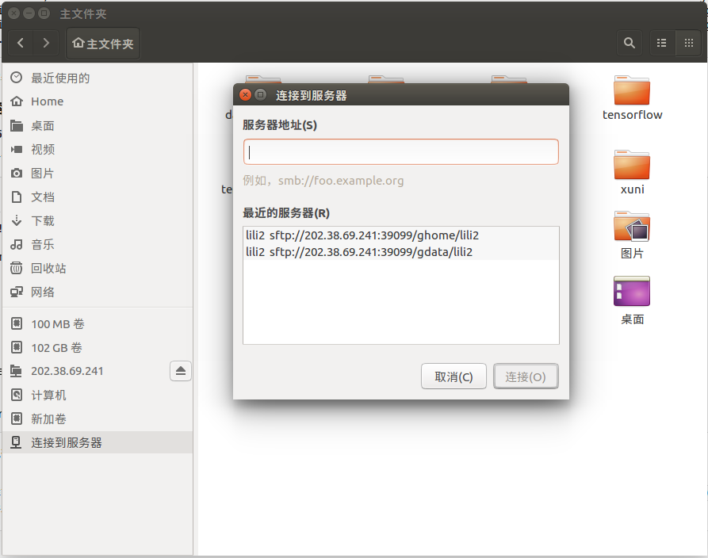
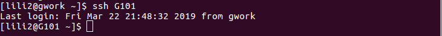
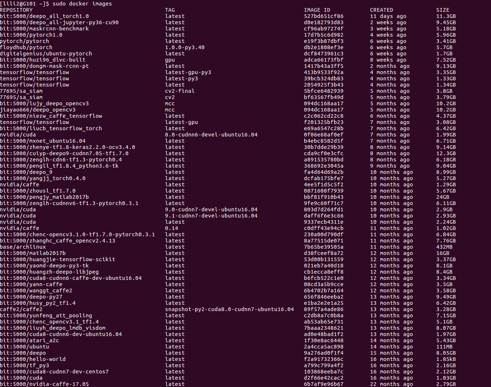
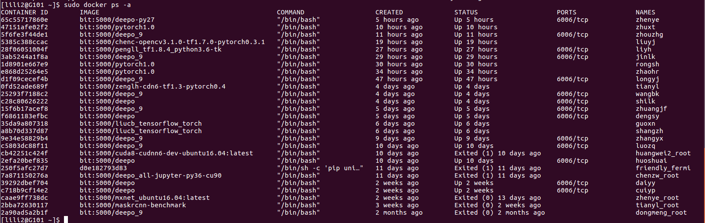
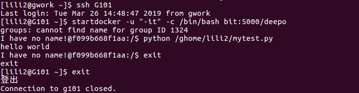
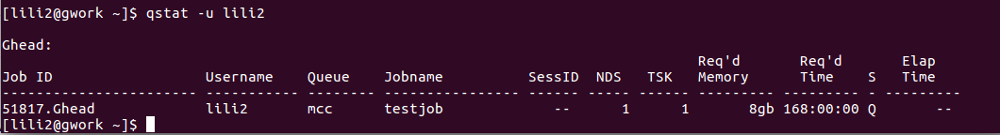
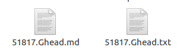
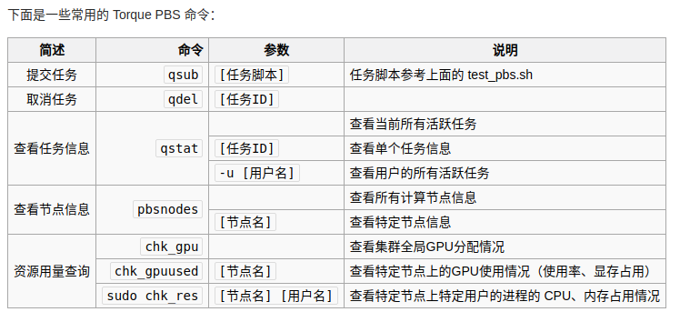

# bit集群学习

如有侵权请联系 zzpzkd@mail.ustc.edu.cn

[TOC]

## 0. 预备知识

### 集群与分布式的概念

**单机结构：**

我们自己的一台台式机或者笔记本，或者一个服务器，就是单机结构。但是单机的处理能力有限，比如一台服务器能同时响应1万个用户输出请求，并返回hello world，  如果同时有10万个用户发出请求，则一台服务器就无法处理，因此就需要集群的概念。（注意这种请求都是相同的，即都是**同一个任务**）

**集群：**

集群是一组协同工作的服务器集合，用来提供比单一服务更稳定、更高效、更具扩展性的服务平台。也就是说，多个服务器放一块，就可以称作一个集群。集群中的每台服务器叫做一个”节点“，节点之间可以相互通信。如果每个节点都处理相同的服务，那么这样系统的处理能力就提升了几倍。如对于刚才的10万个输出请求，使用具有10个节点的集群就可以完成。

问题：

如果现在单个请求是从1万个大电影里面里面找出有王宝强得画面，单个服务器耗尽cpu性能，用尽内存也要1个小时才能完成一次查找，你此时增加多少集群节点也不会缩短单个请求得时间。对于这个任务而言，并不是多少个相同任务的重复，你只有一个任务，从1万个电影中找，因此，再多的节点也无能为力。这时就需要分布式处理。

*Remark:*

- *但问题是用户的请求究竟由哪个节点来处理呢？最好能够让此时此刻负载较小的节点来处理，这样使得每个节点的压力都比较平均。要实现这个功能，就需要在所有节点之前增加一个“调度者”的角色，用户的所有请求都先交给它，然后它根据当前所有节点的负载情况，决定将这个请求交给哪个节点处理。这个“调度者”称作负载均衡服务器。*
- *在集群中，同样的服务可以由多个服务实体提供。因此，当一个节点出现故障时，集群的另一个节点，可以自动接管故障节点的资源，从而保证服务持久、不间断地运行。因而集群具有故障自动转移功能。*

这时把这些大电影分给1万个服务器，每个服务器只负责从一个电影里面找王宝强，找完再汇总给一个服务器，就可以极大的缩短单次查找的时间，这就是分布式计算解决的问题之一

**分布式结构：**

分布式结构就是将一个完整的系统，按照业务功能，拆分成一个个独立的子系统，在分布式结构中，每个子系统就被称为“服务”。这些子系统能够独立运行在web容器中，它们之间通过RPC方式通信。

举个例子，假设需要开发一个在线商城。按照微服务的思想，我们需要按照功能模块拆分成多个独立的服务，如：用户服务、产品服务、订单服务、后台管理服务、数据分析服务等等。这一个个服务都是一个个独立的项目，可以独立运行。如果服务之间有依赖关系，那么通过RPC方式调用。

这样的好处有很多：

1. 系统之间的耦合度大大降低，可以独立开发、独立部署、独立测试，系统与系统之间的边界非常明确，排错也变得相当容易，开发效率大大提升。
2. 系统之间的耦合度降低，从而系统更易于扩展。我们可以针对性地扩展某些服务。假设这个商城要搞一次大促，下单量可能会大大提升，因此我们可以针对性地提升订单系统、产品系统的节点数量，而对于后台管理系统、数据分析系统而言，节点数量维持原有水平即可。
3. 服务的复用性更高。比如，当我们将用户系统作为单独的服务后，该公司所有的产品都可以使用该系统作为用户系统，无需重复开发。

回到刚才的任务，我们需要把从1万个电影中查找的任务，分成1万个子任务：子任务为从1个电影中找王宝强，那么，把这个子任务分配给1万个服务器，这就依靠分布式计算实现了1万倍的加速。

**总结：**

- 从单机结构到集群结构，你的代码基本无需要作任何修改，你要做的仅仅是多部署几台服务器，每台服务器上运行相同的代码就行了。但是，当你要从集群结构演进到分布式结构的时候，之前的那套代码就需要发生较大的改动了（将处理1万部电影的程序改成处理1部）
- 集群是个物理形态，只是把同一个业务，部署在多个服务器上
- 分布式是个工作方式，把一个业务分拆多个子业务，部署在不同的服务器上
- 分布式与集群的比喻： 小饭店原来只有一个厨师，切菜洗菜备料炒菜全干。后来客人多了，厨房一个厨师忙不过来，又请了个厨师，两个厨师都能炒一样的菜，这两个厨师的关系是集群。为了让厨师专心炒菜，把菜做到极致，又请了个配菜师负责切菜，备菜，备料，厨师和配菜师的关系是分布式，一个配菜师也忙不过来了，又请了个配菜师，两个配菜师关系是集群

### Linux 文件结构

在Linux中所有的文件都是基于目录的方式存储的。一切都是目录，一切都是文件。

**以Ubuntu系统为例：**我们打开终端后，可以看到如下界面：


每行命令提示符$之前的内容为：`用户名@主机名：当前所在目录`

- 主机名只有一个，因为我们只有一个主机，但用户名可以有多个，因为我们一台主机我们可以建立多个账户；
- 所有linux系统的根目录文件都和上述截图类似，但后期可能存在多个用户，因此各根目录下的文件夹会根据其自身属性为各个用户根据用户名创建不同的文件夹（有的文件是所有用户共享的，则不会创建）
- 比如终端打开后默认`home`目录~，其实是当前用户的home目录，其绝对路径为`/home/ubuntu16/`

```python
/是一切目录的起点，如大树的主干。其它的所有目录都是基于树干的枝条或者枝叶。ubuntu中硬件设备如光驱、软驱、usb设备都将挂载到这颗繁茂的枝干之下，作为文件来管理。

/home: 用户的主目录，在Linux中，每个用户都有一个自己的目录，一般该目录名是以用户的账号命名的。
/media: ubuntu系统挂载的硬盘、usb设备，存放临时读入的文件。
/tmp: 这个目录是用来存放一些临时文件的，所有用户对此目录都有读写权限。

/bin: bin是Binary的缩写。存放系统中最常用的可执行文件（二进制）。
/boot: 这里存放的是Linux内核和系统启动文件，包括Grub、lilo启动器程序。
/dev: dev是Device(设备)的缩写。该目录存放的是linux的外部设备，如硬盘、分区、键盘、鼠标、usb等。
/etc: 这个目录用来存放所有的系统管理所需要的配置文件和子目录，如passwd、hostname等。
/lib: 存放共享的库文件，包含许多被/bin和/sbin中程序使用的库文件。
/lost+found: 这个目录一般情况下是空的，当系统非法关机后，这里就存放了一些零散文件。
/mnt: 作为被挂载的文件系统得挂载点。
/opt: 作为可选文件和程序的存放目录，主要被第三方开发者用来简易安装和卸载他们的软件。
/proc: 这个目录是一个虚拟的目录，它是系统内存的映射，我们可以通过直接访问这个目录来获取系统信息。这里存放所有标志为文件的进程，比较cpuinfo存放cpu当前工作状态的数据。
/root: 该目录为系统管理员，也称作超级权限者的用户主目录。
/sbin: s就是Super User的意思，这里存放的是系统管理员使用的系统管理程序，如系统管理、目录查询等关键命令文件。
/ srv: 存放系统所提供的服务数据。
/sys: 系统设备和文件层次结构，并向用户程序提供详细的内核数据信息。
    
/usr: 存放与系统用户有关的文件和目录。
/usr 目录具体来说：
/usr/X11R6: 存放X-Windows的目录；
/usr/games: 存放着XteamLinux自带的小游戏；
/usr/bin: 用户和管理员的标准命令；
/usr/sbin: 存放root超级用户使用的管理程序；
/usr/doc: Linux技术文档；
/usr/include: 用来存放Linux下开发和编译应用程序所需要的头文件，for c 或者c++；
/usr/lib: 应用程序和程序包的连接库；
/usr/local: 系统管理员安装的应用程序目录；
/usr/man: 帮助文档所在的目录；
/usr/src: Linux开放的源代码；


/var: 长度可变的文件，尤其是些记录数据，如日志文件和打印机文件。
/var/cache: 应用程序缓存目录；
/var/crash: 系统错误信息；
/var/games: 游戏数据；
/var/log: 日志文件；
/var/mail: 电子邮件；
/var/tmp: 临时文件目录；
    
注: ubuntu严格区分大小写和空格，所以Sun和sun是两个不同的文件。
```


### python程序与python脚本

假设运行环境就是自己的电脑，没有进入集群环境下

编写python程序为test1.py

```python
print("hello world")
```

运行此程序

再编写python脚本为test2.py

```python
#!/usr/bin/env python
print("hello world")
```

运行此脚本的

最后给出运行的指令以及结果的截图，可以看到python程序和python脚本的不同之处


## 1.如何登录集群

首先要有一个帐号，我们这里假设有了一个帐号，

```
帐号和密码是：lili2/*******
```

关于如何申请帐号?

- GPU/CPU集群帐号申请方法

- 信息学院的学生将姓名、学号、导师和集群类型信息发邮件给ypb@ustc.edu.cn,并抄送导师，导师邮件确认后即可创建帐号。申请帐号成功后，请加入GPU使用群，修改昵称为姓名_帐号。
- 集群类型指的是要CPU集群还是GPU集群，这里我们申请的是GPU集群

拿到帐号后即可以登录集群。

Remark:

- 首次登录会提示修改密码；*如未提示，如何修改密码待补充*
- 我们要登录的集群的地址：内网地址192.168.9.99，外网SSH连接：202.38.69.241:39099

我按照官网上的操作，**这里要注意把帐号的用户名改成自己的**

```
ssh -p 39099 lili2@202.38.69.241
```

反馈的结果如下图，已经登录成功 （登录成功后默认处于gwork节点）


## 2.节点与文件系统管理

根据我的猜测，学院应该是有两种类型的集群设备，一种是由GTX1080 构成的**GPU集群**，另一种是两台配置有V100卡的DGX1服务器构成的**高性能计算集群**。我们主要关注GPU集群的使用。

**GPU集群：**

- 该集群共有34个计算节点（34台服务器），其中 PBS 计算节点 G101-G125 每个结点8块GTX 1080Ti GPU卡，共200块卡；G131-G144有76块（152核心）tesla K80卡。
- 该集群计算节点本身没有安装任何计算软件，他们把常用的软件环境封装在[Docker 容器](http://mccipc.ustc.edu.cn/mediawiki/index.php/Dcoker-images)中。
- 该集群使用torque PBS管理计算job，job以docker方式进行运行，禁止以docker方式以外的方式运行job
- 集群提供了一些经典的用于深度学习的镜像，如果仍不能满足要求，可以根据后续章节要求生产自己的镜像；
- 集群提供了一些数据集，如果用户有自己的数据需要提交到数据集，可以向管理员申请，获得批准后将数据集上传到 /gpub/temp，上传完毕后通知管理员处理，将不会占用自己的空间配额。/gpub/temp只是临时空间，会定期清理，重要数据不可以放在这里长存。


**节点类型：**

- 登录/操作控制台 节点 *gwork* (192.168.9.99/202.38.69.241:39099)，用于外部访问和提交 Torque PBS 任务，目前我们就处于这个节点
- 测试节点 `g101`: 专门用于任务调试，正常运行后将限制调试job运行不超过15分钟；可以从gwork节点 通过`ssh g101` 命令登录进去，任务调试成功后，可以切换到Gwork节点下真正执行任务；
- `gproc`节点：专门用于数据传输与解压缩; 可以在gwork节点直接登录进入，也可以在外部通过网址访问：`ssh -p 37240 username@202.38.69.241`

Remark:

- 该集群**所有节点**共享数据存储，有三个共享mount点，分别是 `/ghome; /gdata; /gpub`

  

**文件系统的组成：**

首先我们先查看该集群的根目录：

```python
[username@gwork /]$ ls
bin             chk_nvidia_output  etc     gdata1  home   lifedat  nfstest  root  srv  usr
boot            data0              fengxy  ghome   lib    media    opt      run   sys  var
chk_gpu_output  dev                gdata   gpub    lib64  mnt      proc     sbin  tmp
```

我们可以发现，该集群和之前提到的Linux文件系统组成类似，Linux中我们经常使用`/home/username/`来存放我们的代码和项目，在`/media/ubuntu16/`下挂载我们的硬盘存放数据集，集群中也是如此。

集群所有结点共享数据存储，有三个共享mount点，分别是：

-  /ghome  所有用户的根文件系统，用于存放代码等重要数据，限额50G
-  /gdata  所有用户的数据区，用于存放job运行过程生成的数据以及结果，用户可读写，暂限额500G。
-  /gpub   公共数据集集区，用户只读，对于一些下载的公共数据集，可以提交管理员转移到这里，将不会占用个人的磁盘限额。

同样的，不同用户的文件被放在了不同的文件夹下，该文件夹名称与用户名相同，每个用户只能访问自己的文件夹，别人的文件夹无权访问，即

- 登录后默认的～路径 完整路径为 `/ghome/username/`
- 存放自己的数据集，完整路径为`/gdata/username/`
- `/gpub`下不区分用户


**文件系统登录与文件传输：**

如何通过客户端连接进入ghome下自己的文件夹和gdata下自己的文件夹：

- 打开默认的文件管理器，选最下面的“连接到服务器”，

- 输入对应文件夹网址

  - sftp://202.38.69.241:39099/ghome/username
  - sftp://202.38.69.241:39099/gdata/wangshuai

- 输入用户名和密码

- 此时对应的文件夹便挂载到了自己的文件系统中：如果是运行代码文件，直接复制粘贴到ghome下的自己的文件夹里就行；如果是数据文件，也是复制粘贴到相应文件夹里

  

  具体操作结果可以看下面的图




##  3.测试节点测试docker

1.首先先来了解一下Docker的概念

- 为什么要用到Docker？

  计算集群中各计算节点必须保证软件环境同步。系统软件由管理员人工保持同步（手动安装相同的软件）。系统软件只能安装一套，因此经常出现有的人需要的软件版本与系统中软件版本不一致的情况。集群通过 Docker 容器为用户提供多种不同的软件环境。

- Docker是干什么的？

  Docker 容器可以看作一个与主系统隔离的虚拟机环境。每个用户启动的容器都是从基础镜像生成的一个全新副本，互不干扰。根据使用的基础镜像的不同，有的容器启动后里面安装了 CentOS 系统 + CUDA8，另一些容器安装了 Ubuntu + CUDA9 + TensorFlow，你可以根据自己的需求选择对应的基础镜像然后启动一个容器作为自己的基础环境。

- Docker怎么用？

  这里介绍一些基本操作。注意用户只能在计算节点 G101~G125 上启动 Docker 容器。G101 是测试节点，可以直接登录上去操作下面的命令。其他节点则需要通过 Torque PBS 提交任务脚本使用。直接登录的指令是

  ```
  ssh G101
  ```

  来看一下执行该指令后的页面变化

  

- 区分镜像和容器的概念：镜像是已经配置好的一些虚拟环境，容器是用户申请的工作环境，是系统分配的一个基于某一个镜像的虚拟工作环境，相当于一个虚拟机，你在内部对系统所做的任何操作都将在系统退出后丢失，但对用户根目录下（/ghome/username）的文件操作将不会丢失

2.在G101测试节点上测试一些命令(如果运行结果图片看不清可以放大看)

- ```
  sudo docker images
  ```

  该指令作用：查看可用的Docker镜像，上面有一些详细的信息

  该指令执行后的结果

  

- ```
  sudo docker ps -a
  ```

  该指令的作用：产看正在使用的容器的情况

  该指令的运行结果

  

3.在G101测试节点中进入docker容器中，运行程序

- 首先假设我的测试代码文件为文件：/ghome/username/mytest.py

  ```python
  import tensorflow as tf
  
  print("hello","world")
  print(tf.__version__)
  ```

- 登录G101节点，命令是

  ```
  ssh G101
  ```

- 由于测试节点没有tensorflow，所以必须要进入到docker中，运行如下指令，这将从 **bit:5000/deepo** 镜像生成一个新的容器，并启动一个 bash 给你使用，bash默认位于虚拟系统的根目录下。你可以在里面运行各种各样的程序，就像在任何 Linux 系统上一样。同时你在外面的家目录/ghome/username也被默认挂载到容器当中了

  ```
  startdocker -u "-it" -c /bin/bash bit:5000/deepo
  ```

- 运行指令，得到结果

  ```
  python /ghome/lili2/mytest.py
  ```

- 运行结束，运行 `exit` 命令将退出回到 G101 节点。注意：容器中运行的最后一个程序（此处就是 bash）退出后，容器将会被销毁，这意味着除了你在容器外面共用的存储空间（如/ghome/username）写入的文件以外，其他文件都会被销毁！ 因此，容器中运行的程序应该把结果保存到容器外共用的存储空间中

  ```
  exit
  ```

- 由于docker容器一旦启动，不管是否在容器里运行任务都会占用GPU，因此请各位同学养成良好的调试习惯，在调试完成后请及时使用exit命令退出容器（不要直接关掉terminal，那样不会将容器停止）。

  - [ ] 正常退出的容器将会被自动销毁，

  - [ ] 如果非正常退出，请使用下面第一个指令，查找到自己的容器名或容器id，使用下面第二个指令将其停止

    ```
    sudo docker ps
    ```

    ```
    sudo docker stop CONTAINER_ID/CONTAINER_NAME
    ```

  如果不及时清理无用的容器将会导致其他同学无法正常初始化容器，所以请大家不要在启动容器后长时间挂机。

- 整个运行过程的截图

  

  


## 4.通过 Torque PBS 提交任务

如果编写的脚本在测试节点上运行程序没有问题，就可以到正式节点上提交任务运行了

**！！注意只能在 gwork 节点上提交任务，不能在测试节点提交！**

一共有下面几个步骤

1. 编写任务脚本：Torque 管理系统不能直接提交二进制可执行文件，需要编写一个文本的脚本文件，来描述相关参数情况。下面是一个示例脚本文件 myjob.pbs （假设代码文件依然是上面的mytest.py）：

   ```
   #PBS    -N  testjob
   #PBS    -o  /ghome/<username>/$PBS_JOBID.out
   #PBS    -e  /ghome/<username>/$PBS_JOBID.err
   #PBS    -l nodes=1:gpus=1:S
   #PBS    -r y
   #PBS    -q mcc
   cd $PBS_O_WORKDIR
   echo Time is `date`
   echo Directory is $PWD
   echo This job runs on following nodes:
   echo -n "Node:"
   cat $PBS_NODEFILE
   echo -n "Gpus:"
   cat $PBS_GPUFILE
   echo "CUDA_VISIBLE_DEVICES:"$CUDA_VISIBLE_DEVICES
   startdocker -c "python /ghome/<username>/mytest.py"  bit:5000/deepo
   ```

   解释说明

   - 脚本文件中定义的参数默认是以#PBS 开头的，这就是为什么每一行都有#PBS

   - -N 定义的是 job 名称，可以随意

   - -o 定义程序运行的标准输出文件，如程序中 printf 打印信息,相当于 stdout，注意<username>要改成自己的用户名，所有程序运行的结果会存在那个文件中

   - -e 定义程序运行时的错误输出文件,相当于 stderr，注意<username>要改成自己的用户名，所有程序输出的错误信息会存在那个文件中

   - -l 定义了申请的结点数和 gpus 数量

     nodes=1 代表一个结点，一般申请一个结点，除非用 mpi 并行作业

     gpus=1 定义了申请的 GPU 数量,根据应用实际使用的 gpu数量来确定

     S 表示 job 类型，

     - [ ] 使用单核的 job 必须加参数 S,如：#PBS -l nodes=1:gpus=1:S
     - [ ] 使用双核的 job 必须加参数 D,如：#PBS -l nodes=1:gpus=2:D
     - [ ] 使用>=3 核的 job 必须加参数 M,如：#PBS -l nodes=1:gpus=6:M

     队列系统的默认 job 请求时间是一周，如果运行的 job 时间估计会超过，则可以使用下面的参数：表示请求 300 小时的 job 时间

     ```
     #PBS -l nodes=1:gpus=1:S,walltime=300:00:00
     ```

   - -r y 指明作业是否可运行，y 为可运行，n 为不可运行

   - -q 表示排在哪个队列中，默认是排在batch队列中，后面加上mcc表示排在mcc队列中

   - 后面的 cat 和 echo 信息是打印出时间、路径、运行节点及GPU 分配情况等信息，便于调试

   - 最后一行是执行自己程序的命令，详细解释请看第2步

   - 除了.pbs后缀的脚本文件，还可以是shell脚本或python脚本，但都需要在第一行加解释器，

     - [ ] shell脚本（.sh）需要在第一行加： #!/bin/bash
     - [ ] python脚本（.py）需要在第一行加：#!/usr/local/bin/bash

   - 

2. 最后一行的命令详解

   最后一行的命令其实就是执行自己的程序./my_proc，但是由于程序执行需要借助docker容器的虚拟环境，所以要用到startdocker命令，下面是startdocker命令的解释

   startdocker命令的模板是这样的

   ```
   startdocker  -P <my-proc-config-path> -D <my-data-path> -s <my-script-file> bit:5000/deepo
   ```

   - startdocker是对nvidia-docker的再一次封装，主要为了配合torque pbs和避免root权限管理漏洞

   - -P 参数用来指定代码或配置文件所在的主目录，通常取配置文件和可执行文件的公共父目录，

     如配置文件是/gdata/userx/proc1/conf/my.conf，可执行文件/gdata/userx/proc1/shell/my.sh，则可以取 -P/gdata/userx/proc1  , -s shell/my.sh 

     如果代码就在自己的home目录下，则此参数可以不用设置

   - -D 参数用来指定数据所在目录。如可以是 -D /gdata/userx/proj1，可以没有，如和-P 参数一样则必须省略

   - 需要注意的是D和-P参数不宜使用太高级别的目录如/gdata /ghome等，至少应该到用户的所在目录层次，如/gdata/userx等

   - -s 参数是可执行二进制或脚本文件名，可以给出绝对路径或相对于-P 的相对路径。-s 参数后的my-script-file 可以是shell脚本或python脚本，但都需要在第一行加解释器，

     - [ ] shell脚本（.sh）需要在第一行加： #!/bin/bash
     - [ ] python脚本（.py）需要在第一行加：#!/usr/local/bin/bash

     一个范例如下，这里的mytest.py就是python脚本，这里代码就是在自己的home目录下，没有数据载入，所以只有-s参数

     ```
     startdocker -s /ghome/username/mytest.py bit:5000/deepo
     ```

   - -s还有一个替代命令-c，-c 是执行命令行，和-s 的区别是本参数不会处理相对路径，只解释为命令行，和-s 两者中只能出现一个。

   - 最后的bit:5000/deepo是镜像名称，也可以替换成别的镜像名称

   - startdocker命令的一种简便模式就是下面这个样子，下面的mytest.py就是自己的python程序

     ```
     startdocker -c "python /ghome/<username>/mytest.py"  bit:5000/deepo
     ```

   - 最后再介绍一下在容器中挂在多个目录

     首先刚才介绍的-P 还是-D 参数指定的目录其本质都是使用docker的-v参数进行了卷的挂载

     那么如果两个挂载点依然不够用（比如我想要运行的程序存在两个文件夹下），或者挂载后容器内外目录结构不一样，这个时候就要用-u参数进行挂载点的扩展

     -u参数怎么用？

     - [ ] 针对于挂载后容器内外目录结构不一样的情况：比如需要将/gdata/userx 挂载到容器内部的/userx,可以这样设置-u:  

       ```
       -u "-v /gdata/userx:/userx"
       ```

     - [ ] 针对于两个挂载点不够用的情况，如果需要挂载更多的目录，在 `-u` 后面的引号中增加新的 `-v /XXX:/XXX` 参数就行了（注意路径要用绝对路径）

     - [ ] -u 其实支持其他任意形式的docker参数的传入，如 -u "--ipc=host"等，

     - [ ] 另外，容器启动时工作目录是在容器内的根目录。你的程序里若使用的相对路径可能会出现无权限写文件的错误。可以在 `-u` 后面的引号里添加 `-w 工作目录` 设置容器中的初始工作目录（当然工作目录必须挂载到容器中）：

       如，想要在容器中运行 /ghome/userx/run.sh，那么运行下面的指令就可以使工作目录和容器外的当前工作目录一致（PWD 环境变量是当前工作目录路径）

       ```
       startdocker -u "-v /gdata/用户名:/gdata/用户名 -w ${PWD}" -s /ghome/用户名/run.sh bit:5000/deepo
       ```

     - [ ] 

   - 
   - 

3. 提交任务

   用下面的指令提交任务，注意要在gwork节点提交任务

   ```
   qsub myjob.pbs
   ```

   返回的结果是自己的任务编号

   

4. `qstat` 命令用于查看任务状态，可以直接加任务编号，或者加 `-u 用户名` 查看用户的所有任务（R 状态表示正在运行，C 表示运行完毕、Q 表示正在排队）：

   

5. 过了一会，我的程序运行好了，会看到我的文件夹下多了两个文件，都是返回的两个结果文件（我的电脑中打不开.out文件和.err文件，所以我把它们的后缀名改成了.md和.txt）

   

   其中，因为没有输出错误，所以后一个文件里买没有内容

   前一个文件中的内容展示在下面了，可以对照看看

   ```
   Time is Wed Mar 27 21:15:58 CST 2019
   Directory is /ghome/lili2
   This job runs on following nodes:
   Node:G102
   Gpus:G102-gpu6
   CUDA_VISIBLE_DEVICES:6
   ===== OUTPUT =====
   hello world
   ```

6. 其他指令

   

7. 

8. 

## 5.自定义docker 镜像文件


## 参考文献

<http://mccipc.ustc.edu.cn/mediawiki/index.php/Main_Page>

<http://mccipc.ustc.edu.cn/mediawiki/index.php/Gpu-cluster-manual>

<https://wmg.ustc.edu.cn/wiki/index.php/%E9%9B%86%E7%BE%A4:%E4%BF%A1%E9%99%A2_GPU_%E9%9B%86%E7%BE%A4#.E6.96.87.E4.BB.B6.E7.B3.BB.E7.BB.9F.E7.BB.93.E6.9E.84>

<http://mccipc.ustc.edu.cn/mediawiki/images/4/47/Torque%E4%BD%BF%E7%94%A8%E6%89%8B%E5%86%8C.pdf>

