# XXNet

A detailed summary of the deep learning classic network architectures from 2012 to the present.


<center> Shuai Wang </center>

<center>USTC, April 1, 2019

​    


<center> <font color=red> Copyright (c) 2019 Shuai Wang. All rights reserved. </font> </center>


## 0. Introduction

**Motivation of this project**:

1. The origin and development of various basic deep learning models.
2. The design principle of each model.
3. The comparison of advantages and disadvantages between them.
4. The application scenarios of each model. (How to choose a model for a particular problem?)
5. How do we design a learning model which aims to solve the problems in our research area based on those classic models?

**Table of contents**

1. A brief introduction of the frequently used deep learning models.
2. An keras implementation for each model.
3. The detailed analysis of each model based on its corresponding paper.
4. Some applications based on these models.


## 1. 模型概览

### 1.0 图表展示

| 模型                                    |   大小 | Top-1 准确率 | Top-5 准确率 |    参数数量 | 深度 |
| --------------------------------------- | -----: | -----------: | -----------: | ----------: | ---: |
| [Xception](#xception)                   |  88 MB |        0.790 |        0.945 |  22,910,480 |  126 |
| [VGG16](#vgg16)                         | 528 MB |        0.713 |        0.901 | 138,357,544 |   23 |
| [VGG19](#vgg19)                         | 549 MB |        0.713 |        0.900 | 143,667,240 |   26 |
| [ResNet50](#resnet)                     |  98 MB |        0.749 |        0.921 |  25,636,712 |    - |
| [ResNet101](#resnet)                    | 171 MB |        0.764 |        0.928 |  44,707,176 |    - |
| [ResNet152](#resnet)                    | 232 MB |        0.766 |        0.931 |  60,419,944 |    - |
| [ResNet50V2](#resnet)                   |  98 MB |        0.760 |        0.930 |  25,613,800 |    - |
| [ResNet101V2](#resnet)                  | 171 MB |        0.772 |        0.938 |  44,675,560 |    - |
| [ResNet152V2](#resnet)                  | 232 MB |        0.780 |        0.942 |  60,380,648 |    - |
| [ResNeXt50](#resnet)                    |  96 MB |        0.777 |        0.938 |  25,097,128 |    - |
| [ResNeXt101](#resnet)                   | 170 MB |        0.787 |        0.943 |  44,315,560 |    - |
| [InceptionV3](#inceptionv3)             |  92 MB |        0.779 |        0.937 |  23,851,784 |  159 |
| [InceptionResNetV2](#inceptionresnetv2) | 215 MB |        0.803 |        0.953 |  55,873,736 |  572 |

---


| 模型                                    |   大小 | Top-1 准确率 | Top-5 准确率 |   参数数量 | 深度 |
| --------------------------------------- | -----: | -----------: | -----------: | ---------: | ---: |
| [MobileNet](#mobilenet)                 |  16 MB |        0.704 |        0.895 |  4,253,864 |   88 |
| [MobileNetV2](#mobilenetv2)             |  14 MB |        0.713 |        0.901 |  3,538,984 |   88 |
| [DenseNet121](#densenet)                |  33 MB |        0.750 |        0.923 |  8,062,504 |  121 |
| [DenseNet169](#densenet)                |  57 MB |        0.762 |        0.932 | 14,307,880 |  169 |
| [DenseNet201](#densenet)                |  80 MB |        0.773 |        0.936 | 20,242,984 |  201 |
| [NASNetMobile](#nasnet)                 |  23 MB |        0.744 |        0.919 |  5,326,716 |    - |
| [NASNetLarge](#nasnet)                  | 343 MB |        0.825 |        0.960 | 88,949,818 |    - |

... ...

- Top-1 准确率和 Top-5 准确率都是在 ImageNet 验证集上的结果。
- Depth 表示网络的拓扑深度。这包括激活层，批标准化层等。

---

**CNN网络架构历史**

CNN从90年代的LeNet开始，21世纪初沉寂了10年，直到12年AlexNet开始又再焕发第二春，从ZF Net到VGG，GoogLeNet再到ResNet和最近的DenseNet，网络越来越深，架构越来越复杂，解决反向传播时梯度消失的方法也越来越巧妙。下图是ILSVRC ([ImageNet Large Scale Visual Recognition Competition](http://www.image-net.org/challenges/LSVRC/)) 历年(2010-2017)的Top-5错误率，我们会按照以上经典网络出现的时间顺序对他们进行介绍。


**[ref](https://www.cnblogs.com/skyfsm/p/8451834.html)*

---

**技术路线演进图：**

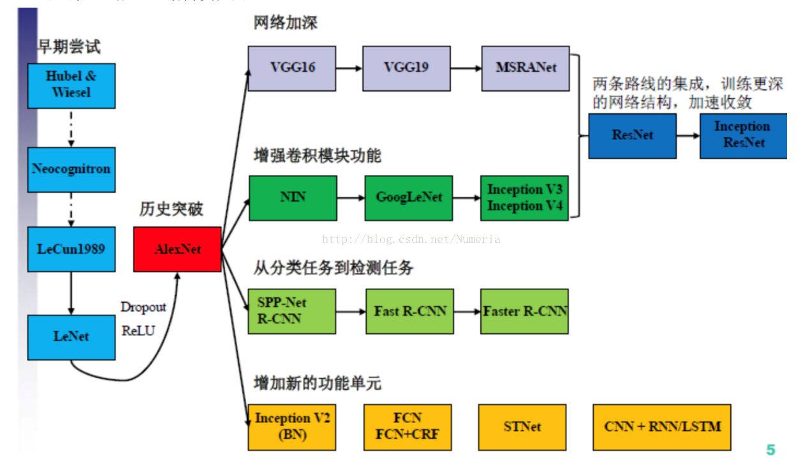

---

### 1.1 LeNet

**主要贡献**：定义了CNN的基本组件，是CNN的鼻祖。

LeNet是卷积神经网络的祖师爷LeCun在**1998**年提出，用于解决手写数字识别的视觉任务。自那时起，CNN的最基本的架构就定下来了：**卷积层、池化层、全连接层**。


如今各大深度学习框架中所使用的LeNet都是简化改进过的LeNet-5（-5表示具有5个层），和原始的LeNet有些许不同，比如把激活函数改为了现在很常用的ReLu。

---

LeNet-5跟现有的`conv->pool->ReLU`的套路不同，它使用的方式是`conv1->pool->conv2->pool2`再接全连接层最后Relu，但是不变的是，卷积层后紧接池化层的模式依旧不变. 


---

#### 1.1.1 LeNet的Keras实现：

```python
def LeNet():
    model = Sequential()
    model.add(Conv2D(32,(5,5),strides=(1,1),input_shape=(28,28,1),padding='valid',activation='relu',kernel_initializer='uniform'))
    model.add(MaxPooling2D(pool_size=(2,2))) # strides=None,default value is pool_size
    model.add(Conv2D(64,(5,5),strides=(1,1),padding='valid',activation='relu',kernel_initializer='uniform'))
    model.add(MaxPooling2D(pool_size=(2,2)))
    model.add(Flatten())
    model.add(Dense(100,activation='relu'))
    model.add(Dense(10,activation='softmax'))
    return model
```

---

### 1.2 AlexNet

AlexNet在2012年ImageNet竞赛中以超过第二名10.9个百分点的绝对优势一举夺冠，从此深度学习和卷积神经网络的研究开始兴起。AlexNet前面5层是卷积层，后面三层是全连接层。(后面一层卷积核数量对应前面卷积核的大小，未标明步长的卷积都为SAME)


**主要贡献：**

- 更深的网络；数据增广；
- ReLU；dropout；
- LRN；

---

**AlexNet用到训练技巧：**

- 使用多GPU训练，所以可以看到第一层卷积层后有两个完全一样的分支，以加速训练。

- 数据增广技巧来增加模型泛化能力：使用了随机裁剪的思路对原来256×256的图像进行随机裁剪，得到尺寸为3×224×224的图像，输入到网络训练。

- 用ReLU代替Sigmoid来加快SGD的收敛速度;使用最大池化代替平均池化；

- Dropout:Dropout原理类似于浅层学习算法的中集成算法，该方法通过让全连接层的神经元（该模型在前两个全连接层引入Dropout）以一定的概率失去活性（比如0.5）失活的神经元不再参与前向和反向传播，相当于约有一半的神经元不再起作用。在测试的时候，让所有神经元的输出乘0.5。Dropout的引用，有效缓解了模型的过拟合。

- Local Responce Normalization：局部响应归一层的基本思路是，对激活层的某一块，对每个像素根据通道进行归一化。其动机是，对于这张 13×13 的图像中的每个位置来说，我们可能并不需要太多的高激活神经元(通过归一化进行抑制)。
  $$
  b_{x,y}^i = a_{x,y}^i / (k + \alpha \sum_{j=max(0,i-n/2)}^{min(N-1,i+n/2)}(a_{x,y}^j)^2)^\beta
  $$
  其中i是通道，a是输入，b是输出，N是总的通道数，其他为自定义参数。*但是后来，很多研究者发现 LRN 起不到太大作用，因为并不重要，而且我们现在并不用 LRN 来训练网络。*

---

**AlexNet的Keras实现：**

```python
def AlexNet():

    model = Sequential()
    model.add(Conv2D(96,(11,11),strides=(4,4),input_shape=(227,227,3),padding='valid',activation='relu',kernel_initializer='uniform'))
    model.add(MaxPooling2D(pool_size=(3,3),strides=(2,2)))
    model.add(Conv2D(256,(5,5),strides=(1,1),padding='same',activation='relu',kernel_initializer='uniform'))
    model.add(MaxPooling2D(pool_size=(3,3),strides=(2,2)))
    model.add(Conv2D(384,(3,3),strides=(1,1),padding='same',activation='relu',kernel_initializer='uniform'))
    model.add(Conv2D(384,(3,3),strides=(1,1),padding='same',activation='relu',kernel_initializer='uniform'))
    model.add(Conv2D(256,(3,3),strides=(1,1),padding='same',activation='relu',kernel_initializer='uniform'))
    model.add(MaxPooling2D(pool_size=(3,3),strides=(2,2)))
    model.add(Flatten())
    model.add(Dense(4096,activation='relu'))
    model.add(Dropout(0.5))
    model.add(Dense(4096,activation='relu'))
    model.add(Dropout(0.5))
    model.add(Dense(1000,activation='softmax'))
    return model
```

---


### 1.3 ZF-Net

ZFNet是2013 ImageNet分类任务的冠军，其网络结构没什么改进，只是调了调参，性能较Alex提升了不少。ZF-Net只是将AlexNet第一层卷积核由11变成7，步长由4变为2，第3，4，5卷积层转变为384，384，256。这一年的ImageNet还是比较平静的一届，其冠军ZF-Net的名堂也没其他届的经典网络架构响亮。


---

**ZF-Net的Keras实现：**

```python
def ZF_Net():
    model = Sequential()  
    model.add(Conv2D(96,(7,7),strides=(2,2),input_shape=(224,224,3),padding='valid',activation='relu',kernel_initializer='uniform'))  
    model.add(MaxPooling2D(pool_size=(3,3),strides=(2,2)))  
    model.add(Conv2D(256,(5,5),strides=(2,2),padding='same',activation='relu',kernel_initializer='uniform'))  
    model.add(MaxPooling2D(pool_size=(3,3),strides=(2,2)))  
    model.add(Conv2D(384,(3,3),strides=(1,1),padding='same',activation='relu',kernel_initializer='uniform'))  
    model.add(Conv2D(384,(3,3),strides=(1,1),padding='same',activation='relu',kernel_initializer='uniform'))  
    model.add(Conv2D(256,(3,3),strides=(1,1),padding='same',activation='relu',kernel_initializer='uniform'))  
    model.add(MaxPooling2D(pool_size=(3,3),strides=(2,2)))  
    model.add(Flatten())  
    model.add(Dense(4096,activation='relu'))  
    model.add(Dropout(0.5))  
    model.add(Dense(4096,activation='relu'))  
    model.add(Dropout(0.5))  
    model.add(Dense(1000,activation='softmax'))  
    return model
```

---

### 1.4 VGG-Nets

VGG-Nets是由牛津大学VGG（Visual Geometry Group）提出，是2014年ImageNet竞赛定位任务的第一名和分类任务的第二名中的基础网络。VGG可以看成是加深版本的AlexNet. 都是conv layer + FC layer。

​                      

---

**动机**：为了解决初始化（权重初始化）等问题，VGG采用的是一种Pre-training的方式，就是先训练一部分小网络，然后再确保这部分网络稳定之后，再在这基础上逐渐加深，表1从左到右体现的就是这个过程。


由上图看出，VGG-16的结构非常整洁，深度较AlexNet深得多，里面包含多个`conv->conv->max_pool`这类的结构, VGG的卷积层都是`same`的卷积，即卷积过后的输出图像的尺寸与输入是一致的，它的下采样完全是由max pooling来实现。filter的个数（卷积后的输出通道数）从64开始，每接一个pooling后其成倍的增加，最后使用3个全连接层。

---

**主要贡献**：

- 卷积层使用更小的filter尺寸和间隔
- 有规则的卷积池化操作

多个小卷积核在感受野上可以等价于一个大卷积核。如：2个3x3的卷积核等价于1个5x5的卷积核，3个3x3的卷积核等价于1个7x7的卷积核，但使用**3×3卷积核将有如下优点：**

- 多个3×3的卷基层比一个大尺寸filter卷基层有更多的非线性，使得判决函数更加具有判决性
- 多个3×3的卷积层比一个大尺寸的filter有更少的参数，假设卷积层的输入和输出的特征图大小相同为C，那么三个3×3的卷积层参数个数3×（3×3×C×C）=27CC；一个7×7的卷积层参数为49CC；

**1*1卷积核的优点：**

- 作用是在不影响输入输出维数的情况下，对输入进行线性形变，然后通过Relu进行非线性处理，增加网络的非线性表达能力，并且增加了网络的深度。

---

**VGG-16的Keras实现：**

```python
def VGG_16():   
    model = Sequential()
    
    model.add(Conv2D(64,(3,3),strides=(1,1),input_shape=(224,224,3),padding='same',activation='relu',kernel_initializer='uniform'))
    model.add(Conv2D(64,(3,3),strides=(1,1),padding='same',activation='relu',kernel_initializer='uniform'))
    model.add(MaxPooling2D(pool_size=(2,2)))
    
    model.add(Conv2D(128,(3,2),strides=(1,1),padding='same',activation='relu',kernel_initializer='uniform'))
    model.add(Conv2D(128,(3,3),strides=(1,1),padding='same',activation='relu',kernel_initializer='uniform'))
    model.add(MaxPooling2D(pool_size=(2,2)))
    
    model.add(Conv2D(256,(3,3),strides=(1,1),padding='same',activation='relu',kernel_initializer='uniform'))
    model.add(Conv2D(256,(3,3),strides=(1,1),padding='same',activation='relu',kernel_initializer='uniform'))
    model.add(Conv2D(256,(3,3),strides=(1,1),padding='same',activation='relu',kernel_initializer='uniform'))
    model.add(MaxPooling2D(pool_size=(2,2)))
    
    model.add(Conv2D(512,(3,3),strides=(1,1),padding='same',activation='relu',kernel_initializer='uniform'))
    model.add(Conv2D(512,(3,3),strides=(1,1),padding='same',activation='relu',kernel_initializer='uniform'))
    model.add(Conv2D(512,(3,3),strides=(1,1),padding='same',activation='relu',kernel_initializer='uniform'))
    model.add(MaxPooling2D(pool_size=(2,2)))
    
    model.add(Conv2D(512,(3,3),strides=(1,1),padding='same',activation='relu',kernel_initializer='uniform'))
    model.add(Conv2D(512,(3,3),strides=(1,1),padding='same',activation='relu',kernel_initializer='uniform'))
    model.add(Conv2D(512,(3,3),strides=(1,1),padding='same',activation='relu',kernel_initializer='uniform'))
    model.add(MaxPooling2D(pool_size=(2,2)))
```

---

```python

    model.add(Flatten())
    model.add(Dense(4096,activation='relu'))
    model.add(Dropout(0.5))
    model.add(Dense(4096,activation='relu'))
    model.add(Dropout(0.5))
    model.add(Dense(1000,activation='softmax'))
    
    return model
```


### 1.5 GoogLeNet

GoogLeNet在2014的ImageNet分类任务上击败了VGG-Nets夺得冠军，GoogLeNet跟AlexNet, VGG-Nets这种单纯依靠增加网络层数进而改进网络性能的思路不一样，它另辟幽径，在加深网络的同时（22层），引入Inception结构代替了单纯的卷积+激活的传统操作（这思路最早由Network in Network提出）。


**主要贡献：**

- 引入Inception结构；中间层的辅助LOSS单元；后面的全连接层全部替换为简单的全局平均pooling

---

**Inception 单元：**


**动机：**1. 无法确定采用多大的卷积核比较合适；（待补充）

**方式：**1. 通过3×3的池化、以及1×1、3×3和5×5这三种不同尺度的卷积核，一共4种方式对输入的特征图做特征提取；(结构里卷积的stride都是1，另外为了保持特征响应图大小一致，都用了零填充。最后每个卷积层后面都立刻接一个ReLU层); 2. 然后接一个concatenate的层，把4组不同类型但大小相同的特征响应图一张张并排叠起来，形成新的特征响应图，然后不断重复此结构；3. 为了降低计算量，同时让信息通过更少的连接传递以达到更加稀疏的特性，采用1×1卷积核来实现降维；

---

**1×1卷积核如何实现降维:** 保持原有卷积核数量大小不变，但运算量及最终输出深度大大减少。

 

---

**GoogLeNet的3个LOSS单元：**

- 在中间层加入辅助计算的LOSS单元，目的是计算损失时让低层的特征也有很好的区分能力，从而让网络更好地被训练，辅助收敛。在论文中，这两个辅助LOSS单元的计算被乘以0.3，然后和最后的LOSS相加作为最终的损失函数来训练网络。

**去掉全连接层：**

- 全连接层全部替换为简单的全局平均pooling，在最后参数会变的更少。而在AlexNet中最后3层的全连接层参数差不多占总参数的90%。

---

**GoogLeNet的Keras实现：**

```python
def Conv2d_BN(x, nb_filter,kernel_size, padding='same',strides=(1,1),name=None):
    if name is not None:
        bn_name = name + '_bn'
        conv_name = name + '_conv'
    else:
        bn_name = None
        conv_name = None

    x = Conv2D(nb_filter,kernel_size,padding=padding,strides=strides,activation='relu',name=conv_name)(x)
    x = BatchNormalization(axis=3,name=bn_name)(x)
    return x

def Inception(x,nb_filter):
    branch1x1 = Conv2d_BN(x,nb_filter,(1,1), padding='same',strides=(1,1),name=None)

    branch3x3 = Conv2d_BN(x,nb_filter,(1,1), padding='same',strides=(1,1),name=None)
    branch3x3 = Conv2d_BN(branch3x3,nb_filter,(3,3), padding='same',strides=(1,1),name=None)
    #注意这里1x1卷积与3x3卷积使用相同的卷积核，即使这样也能实现降维度
    branch5x5 = Conv2d_BN(x,nb_filter,(1,1), padding='same',strides=(1,1),name=None)
    branch5x5 = Conv2d_BN(branch5x5,nb_filter,(1,1), padding='same',strides=(1,1),name=None)
    # 因为维度最大的地方是concatenation之后的维度，不能在这个维度上直接3x3卷积
    branchpool = MaxPooling2D(pool_size=(3,3),strides=(1,1),padding='same')(x)
    branchpool = Conv2d_BN(branchpool,nb_filter,(1,1),padding='same',strides=(1,1),name=None)

    x = concatenate([branch1x1,branch3x3,branch5x5,branchpool],axis=3)

    return x
```

---

```python
def GoogLeNet():
    inpt = Input(shape=(224,224,3))
    #padding = 'same'，填充为(步长-1）/2,还可以用ZeroPadding2D((3,3))
    x = Conv2d_BN(inpt,64,(7,7),strides=(2,2),padding='same')
    x = MaxPooling2D(pool_size=(3,3),strides=(2,2),padding='same')(x)
    x = Conv2d_BN(x,192,(3,3),strides=(1,1),padding='same')
    x = MaxPooling2D(pool_size=(3,3),strides=(2,2),padding='same')(x)
    x = Inception(x,64)#256
    x = Inception(x,120)#480
    x = MaxPooling2D(pool_size=(3,3),strides=(2,2),padding='same')(x)
    x = Inception(x,128)#512
    x = Inception(x,128)
    x = Inception(x,128)
    x = Inception(x,132)#528
    x = Inception(x,208)#832
    x = MaxPooling2D(pool_size=(3,3),strides=(2,2),padding='same')(x)
    x = Inception(x,208)
    x = Inception(x,256)#1024
    x = AveragePooling2D(pool_size=(7,7),strides=(7,7),padding='same')(x)
    x = Dropout(0.4)(x)
    x = Dense(1000,activation='relu')(x)
    x = Dense(1000,activation='softmax')(x)
    model = Model(inpt,x,name='inception')
    return model
```


---


### 1.5 ResNet

2015年何恺明推出的ResNet在ISLVRC和COCO上包揽了所有任务的冠军。ResNet引入了shortcut，开启了新的研究思路。

**研究动机：**

- 梯度消失问题：因为梯度是从后向前传播的，随着网络深度增加，比较靠前的层梯度会很小甚至消失，这意味着这些层基本上学习停滞了；
- 网络退化问题：当网络更深时意味着参数空间更大，优化问题变得更难，因此简单地去增加网络深度反而出现更高的训练误差，深层网络虽然收敛了，但深层网络的测试误差却大于浅层网络，不是因为过拟合（训练集训练误差依然很高）；
- 残差网络ResNet设计一种残差模块让我们可以训练更深的网络。


---

**思想来源：**

There exists a solution by construction to the deeper model: the added layers are identity mapping, and the other layers are copied from the learned shallower model. The existence of this constructed solution indicates that a deeper model should produce no higher training error than its shallower counterpart. But experiments show that our current solvers on hand are unable to find solutions that are comparably good or better than the constructed solution (or unable to do so in feasible time).

**主要贡献：**

- Our extremely deep residual nets are easy to optimize, but the counterpart “plain” nets (that simply stack layers) exhibit higher training error when the depth increases; 
- Our deep residual nets can easily enjoy accuracy gains from greatly increased depth, producing re- sults substantially better than previous networks.

---

**残差块：**

In this paper, we address the **degradation problem** by introducing a deep residual learning framework. Instead of hoping each few stacked layers directly fit a desired underlying mapping, we explicitly let these layers fit a residual mapping. 

- Formally, denoting the desired underlying mapping as $H(x)$, we let the stacked nonlinear layers fit another mapping of  (residual function)
  $$
  F(x) = H(x) - x
  $$
  (assuming that the input and output are of the same dimensions)

- The original mapping is recast into
  $$
  F(x) + x 
  $$

- We hypothesize that is easier to optimize the residual mapping **than to optimize the original, unreferenced mapping.** 

- To the extreme, if an identity mapping were optimal, it would be easier to push the residual to zero **than to fit an identity mapping** by a stack of nonlinear layers.

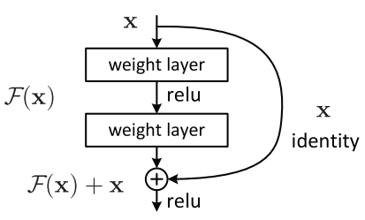

---

**维度匹配问题：**考虑到x的维度与F(X)维度可能不匹配情况，

- zero_padding:对恒等层进行0填充的方式将维度补充完整。这种方法不会增加额外的参数
- projection:在恒等层采用1x1的卷积核来增加维度。这种方法会增加额外的参数

**两种形态的残差模块：**

左图是常规残差模块，用于较浅的残差网络(Res34)，由两个3×3卷积核卷积核组成；但是想要训练更深的网络(Res50/101/152)，这种残差结构不再适用。针对这问题，右图的“瓶颈残差模块”（bottleneck residual block）可以有更好的效果，它依次由1×1、3×3、1×1这三个卷积层堆积而成，这里的1×1的卷积能够起降维或升维的作用，从而令3×3的卷积可以在相对较低维度的输入上进行，以达到提高计算效率的目的。**(借鉴Inception)**


---

**ResNet-50的Keras实现：**

```python
def Conv2d_BN(x, nb_filter,kernel_size, strides=(1,1), padding='same',name=None):
    if name is not None:
        bn_name = name + '_bn'
        conv_name = name + '_conv'
    else:
        bn_name = None
        conv_name = None

    x = Conv2D(nb_filter,kernel_size,padding=padding,strides=strides,activation='relu',name=conv_name)(x)
    x = BatchNormalization(axis=3,name=bn_name)(x)
    return x

def Conv_Block(inpt,nb_filter,kernel_size,strides=(1,1), with_conv_shortcut=False):
    x = Conv2d_BN(inpt,nb_filter=nb_filter[0],kernel_size=(1,1),strides=strides,padding='same')
    x = Conv2d_BN(x, nb_filter=nb_filter[1], kernel_size=(3,3), padding='same')
    x = Conv2d_BN(x, nb_filter=nb_filter[2], kernel_size=(1,1), padding='same')
    if with_conv_shortcut:
        shortcut = Conv2d_BN(inpt,nb_filter=nb_filter[2],strides=strides,kernel_size=kernel_size)
        x = add([x,shortcut])
        return x
    else:
        x = add([x,inpt])
        return x
```

---

```python
def ResNet50():
    inpt = Input(shape=(224,224,3))
    x = ZeroPadding2D((3,3))(inpt)
    x = Conv2d_BN(x,nb_filter=64,kernel_size=(7,7),strides=(2,2),padding='valid')
    x = MaxPooling2D(pool_size=(3,3),strides=(2,2),padding='same')(x)
    
    x = Conv_Block(x,nb_filter=[64,64,256],kernel_size=(3,3),strides=(1,1),with_conv_shortcut=True)
    x = Conv_Block(x,nb_filter=[64,64,256],kernel_size=(3,3))
    x = Conv_Block(x,nb_filter=[64,64,256],kernel_size=(3,3))
    # 借鉴VGGNet
    x = Conv_Block(x,nb_filter=[128,128,512],kernel_size=(3,3),strides=(2,2),with_conv_shortcut=True)
    x = Conv_Block(x,nb_filter=[128,128,512],kernel_size=(3,3))
    x = Conv_Block(x,nb_filter=[128,128,512],kernel_size=(3,3))
    x = Conv_Block(x,nb_filter=[128,128,512],kernel_size=(3,3))
    
    x = Conv_Block(x,nb_filter=[256,256,1024],kernel_size=(3,3),strides=(2,2),with_conv_shortcut=True)
    x = Conv_Block(x,nb_filter=[256,256,1024],kernel_size=(3,3))
    x = Conv_Block(x,nb_filter=[256,256,1024],kernel_size=(3,3))
    x = Conv_Block(x,nb_filter=[256,256,1024],kernel_size=(3,3))
    x = Conv_Block(x,nb_filter=[256,256,1024],kernel_size=(3,3))
    x = Conv_Block(x,nb_filter=[256,256,1024],kernel_size=(3,3))
    
    x = Conv_Block(x,nb_filter=[512,512,2048],kernel_size=(3,3),strides=(2,2),with_conv_shortcut=True)
    x = Conv_Block(x,nb_filter=[512,512,2048],kernel_size=(3,3))
    x = Conv_Block(x,nb_filter=[512,512,2048],kernel_size=(3,3))
    x = AveragePooling2D(pool_size=(7,7))(x)
    x = Flatten()(x)
    x = Dense(1000,activation='softmax')(x)
    
    model = Model(inputs=inpt,outputs=x)
    return model
```

---


### 1.6 DenseNet

自Resnet提出以后，ResNet的变种网络层出不穷，都各有其特点，网络性能也有一定的提升。CVPR 2017最佳论文DenseNet（Dense Convolutional Network）在CIFAR指标上全面超越ResNet。DenseNet吸收了ResNet最精华的部分，并在此上做了更加创新的工作，使得网络性能进一步提升。

**主要贡献：**

- 密集连接：缓解梯度消失问题，加强特征传播，鼓励特征复用，极大的减少了参数量

---

DenseNet 是一种具有密集连接的卷积神经网络。在该网络中，任何两层之间都有直接的连接，也就是说，网络每一层的输入都是**前面所有层输出的并集**，而该层所学习的特征图也会被直接**传给其后面所有层**作为输入。


上图是 DenseNet 的一个`Dense Block`示意图，一个`Dense Block`里面的结构与ResNet中的BottleNeck基本一致：`BN-ReLU-Conv(1×1)-BN-ReLU-Conv(3×3)` ，一个`Dense Block`由多个这种block组成, 最后一个DenseNet又由多个`Dense Block`组成，每个DenseBlock的之间层称为transition layers，`BN−>Conv(1×1)−>averagePooling(2×2)` 组成。

---

**结构分析：**

- DenseNet则是让l层的输入直接影响到之后的所有层，它的输出为：xl=Hl([X0,X1,…,xl−1])，其中[x0,x1,...,xl−1]就是将之前的feature map以通道的维度进行合并。由于每一层都包含之前所有层的输出信息，因此其只需要很少的特征图，从而使得DneseNet的参数量较其他模型大大减少的原因。
- 并且，特征图的减少避免了密集连接带来的特征冗余与之前方法对特征图的重复利用；
- 最后，这种dense connection相当于每一层都直接连接input和loss，因此就可以减轻梯度消失现象，从而训练更深的网络。
- 需要明确一点，dense connectivity 仅仅是在一个dense block里的，不同dense block 之间是没有dense connectivity的，比如下图所示。


*在同层深度下获得更好的收敛率，自然是有额外代价的。其代价之一，就是其恐怖的内存占用。*

---

**网络整体结构**


---

**DenseNet-121的Keras实现：**

```python
def DenseNet121(nb_dense_block=4, growth_rate=32, nb_filter=64, reduction=0.0, dropout_rate=0.0, weight_decay=1e-4, classes=1000, weights_path=None):
    '''Instantiate the DenseNet 121 architecture,
        # Arguments
            nb_dense_block: number of dense blocks to add to end
            growth_rate: number of filters to add per dense block
            nb_filter: initial number of filters
            reduction: reduction factor of transition blocks.
            dropout_rate: dropout rate
            weight_decay: weight decay factor
            classes: optional number of classes to classify images
            weights_path: path to pre-trained weights
        # Returns
            A Keras model instance.
    '''
    eps = 1.1e-5

    # compute compression factor
    compression = 1.0 - reduction


```

---

```python
    # Handle Dimension Ordering for different backends
    # concat_axis means the axis/dimension to concatenate. if your input tensor has
    # shape (samples, channels, rows, cols), set concat_axis to 1 to 
    # concatenate per feature map (channels axis).
    global concat_axis
    if K.image_dim_ordering() == 'tf':
      concat_axis = 3
      img_input = Input(shape=(224, 224, 3), name='data')
    else:
      concat_axis = 1
      img_input = Input(shape=(3, 224, 224), name='data')

    # From architecture for ImageNet (Table 1 in the paper)
    nb_filter = 64
    nb_layers = [6,12,24,16] # For DenseNet-121

    # Initial convolution
    x = ZeroPadding2D((3, 3), name='conv1_zeropadding')(img_input)
    x = Convolution2D(nb_filter, 7, 7, subsample=(2, 2), name='conv1', bias=False)(x)
    x = BatchNormalization(epsilon=eps, axis=concat_axis, name='conv1_bn')(x)
    x = Scale(axis=concat_axis, name='conv1_scale')(x)
    x = Activation('relu', name='relu1')(x)
    x = ZeroPadding2D((1, 1), name='pool1_zeropadding')(x)
    x = MaxPooling2D((3, 3), strides=(2, 2), name='pool1')(x)
```


---

```python
 # Add dense blocks
    for block_idx in range(nb_dense_block - 1):
        stage = block_idx+2
        x, nb_filter = dense_block(x, stage, nb_layers[block_idx], nb_filter, growth_rate, dropout_rate=dropout_rate, weight_decay=weight_decay)

        # Add transition_block
        x = transition_block(x, stage, nb_filter, compression=compression, dropout_rate=dropout_rate, weight_decay=weight_decay)
        nb_filter = int(nb_filter * compression)

    final_stage = stage + 1
    x, nb_filter = dense_block(x, final_stage, nb_layers[-1], nb_filter, growth_rate, dropout_rate=dropout_rate, weight_decay=weight_decay)

    x = BatchNormalization(epsilon=eps, axis=concat_axis, name='conv'+str(final_stage)+'_blk_bn')(x)
    x = Scale(axis=concat_axis, name='conv'+str(final_stage)+'_blk_scale')(x)
    x = Activation('relu', name='relu'+str(final_stage)+'_blk')(x)
    x = GlobalAveragePooling2D(name='pool'+str(final_stage))(x)

    x = Dense(classes, name='fc6')(x)
    x = Activation('softmax', name='prob')(x)

    model = Model(img_input, x, name='densenet')

    if weights_path is not None:
      model.load_weights(weights_path)

    return model
```

---

```python
def conv_block(x, stage, branch, nb_filter, dropout_rate=None, weight_decay=1e-4):
    '''Apply BatchNorm, Relu, bottleneck 1x1 Conv2D, 3x3 Conv2D, and option dropout
    # Arguments
    x: input tensor;   stage: index for dense block;   branch: layer index within each dense block;  nb_filter: number of filters; dropout_rate: dropout rate;    weight_decay: weight decay factor
    '''
    eps = 1.1e-5
    conv_name_base = 'conv' + str(stage) + '_' + str(branch)
    relu_name_base = 'relu' + str(stage) + '_' + str(branch)

    # 1x1 Convolution (Bottleneck layer)
    inter_channel = nb_filter * 4  
    x = BatchNormalization(epsilon=eps, axis=concat_axis, name=conv_name_base+'_x1_bn')(x)
    x = Scale(axis=concat_axis, name=conv_name_base+'_x1_scale')(x)
    x = Activation('relu', name=relu_name_base+'_x1')(x)
    x = Convolution2D(inter_channel, 1, 1, name=conv_name_base+'_x1', bias=False)(x)

    if dropout_rate:
        x = Dropout(dropout_rate)(x)

    # 3x3 Convolution
    x = BatchNormalization(epsilon=eps, axis=concat_axis, name=conv_name_base+'_x2_bn')(x)
    x = Scale(axis=concat_axis, name=conv_name_base+'_x2_scale')(x)
    x = Activation('relu', name=relu_name_base+'_x2')(x)
    x = ZeroPadding2D((1, 1), name=conv_name_base+'_x2_zeropadding')(x)
    x = Convolution2D(nb_filter, 3, 3, name=conv_name_base+'_x2', bias=False)(x)

    if dropout_rate:
        x = Dropout(dropout_rate)(x)

    return x
```

---

```python
def transition_block(x, stage, nb_filter, compression=1.0, dropout_rate=None, weight_decay=1E-4):
    ''' Apply BatchNorm, 1x1 Convolution, averagePooling, optional compression, dropout 
        # Arguments
            x: input tensor
            stage: index for dense block
            nb_filter: number of filters
            compression: calculated as 1 - reduction. Reduces the number of feature maps in the transition block.
            dropout_rate: dropout rate
            weight_decay: weight decay factor
    '''

    eps = 1.1e-5
    conv_name_base = 'conv' + str(stage) + '_blk'
    relu_name_base = 'relu' + str(stage) + '_blk'
    pool_name_base = 'pool' + str(stage) 

    x = BatchNormalization(epsilon=eps, axis=concat_axis, name=conv_name_base+'_bn')(x)
    x = Scale(axis=concat_axis, name=conv_name_base+'_scale')(x)
    x = Activation('relu', name=relu_name_base)(x)
    x = Convolution2D(int(nb_filter * compression), 1, 1, name=conv_name_base, bias=False)(x)

    if dropout_rate:
        x = Dropout(dropout_rate)(x)

    x = AveragePooling2D((2, 2), strides=(2, 2), name=pool_name_base)(x)

    return x
```

---

```python
def dense_block(x, stage, nb_layers, nb_filter, growth_rate, dropout_rate=None, weight_decay=1e-4, grow_nb_filters=True):
    ''' Build a dense_block where the output of each conv_block is fed to subsequent ones
        # Arguments
            x: input tensor
            stage: index for dense block
            nb_layers: the number of layers of conv_block to append to the model.
            nb_filter: number of filters
            growth_rate: growth rate
            dropout_rate: dropout rate
            weight_decay: weight decay factor
            grow_nb_filters: flag to decide to allow number of filters to grow
    '''

    eps = 1.1e-5
    concat_feat = x

    for i in range(nb_layers):
        branch = i+1
        x = conv_block(concat_feat, stage, branch, growth_rate, dropout_rate, weight_decay)
        concat_feat = merge([concat_feat, x], mode='concat', concat_axis=concat_axis, name='concat_'+str(stage)+'_'+str(branch))

        if grow_nb_filters:
            nb_filter += growth_rate

    return concat_feat, nb_filter
```

---

<https://medium.com/@CinnamonAITaiwan/cnn模型-resnet-mobilenet-densenet-shufflenet-efficientnet-5eba5c8df7e4> 补充更新！！！

## 2. 模型详解

### 2.1 VGGNet

**VGGNet Keras 预训练模型调用**

```python
## 调用VGG16
keras.applications.vgg16.VGG16(include_top=True, weights='imagenet', input_tensor=None, input_shape=None, pooling=None, classes=1000)

## 调用VGG19
keras.applications.vgg19.VGG19(include_top=True, weights='imagenet', input_tensor=None, input_shape=None, pooling=None, classes=1000)
```

- 该模型权值由 ImageNet 训练而来，可同时构建于 `channels_first` (通道，高度，宽度) 和 `channels_last` （高度，宽度，通道）两种输入维度顺序。
- 模型默认输入尺寸是 224x224。

---

**参数**

- __include_top__: 是否包括顶层的全连接层。
- __weights__: `None` 代表随机初始化， `'imagenet'` 代表加载在 ImageNet 上预训练的权值。
- __input_tensor__: 可选，Keras tensor 作为模型的输入（即 `layers.Input()` 输出的 tensor）。
- __input_shape__: 可选，输入尺寸元组，仅当 `include_top=False` 时有效，否则输入形状必须是 `(244, 244, 3)`（对于 `channels_last` 数据格式），或者 `(3, 244, 244)`（对于 `channels_first` 数据格式）。它必须拥有 3 个输入通道，且宽高必须不小于 32。例如 `(200, 200, 3)` 是一个合法的输入尺寸。
- __pooling__: 可选，当 `include_top` 为 `False` 时，该参数指定了特征提取时的池化方式。
  - `None` 代表不池化，直接输出最后一层卷积层的输出，该输出是一个四维张量。
  - `'avg'` 代表全局平均池化（GlobalAveragePooling2D），相当于在最后一层卷积层后面再加一层全局平均池化层，输出是一个二维张量。
  - `'max'` 代表全局最大池化
- __classes__: 可选，图片分类的类别数，仅当 `include_top` 为 `True` 并且不加载预训练权值时可用。

---

**返回值**：

- 一个 Keras `Model` 对象。

**参考文献**：

- [Very Deep Convolutional Networks for Large-Scale Image Recognition](https://arxiv.org/abs/1409.1556)：如果在研究中使用了VGG，请引用该论文。

**License**：

- 预训练权值由 [VGG at Oxford](http://www.robots.ox.ac.uk/~vgg/research/very_deep/) 发布的预训练权值移植而来，基于 [Creative Commons Attribution License](https://creativecommons.org/licenses/by/4.0/)。

---

#### 2.1.1 Very Deep Convolutional Networks for Large-Scale Image Recognition

*Karen Simonyan∗ & Andrew Zisserman (2014)*

**Abstract**

1. In this work we investigate the effect of the convolutional network depth on its accuracy in the large-scale image recognition setting. 
2. Our main contribution is a thorough evaluation of networks of increasing depth using an architecture with very small (3×3) convolution filters, which shows that a significant improvement on the prior-art configurations can be achieved by pushing the depth to 16–19 weight layers. 
3. These findings were the basis of our ImageNet Challenge **2014** submission, where our team secured the first and the second places in the localisation and classification tracks respectively. 
4. We also show that our representations generalise well to other datasets, where they achieve state-of-the-art results. 

## Introduction

1. With ConvNets becoming **more of a commodity** in the computer vision field, **a number of at- tempts have been made to improve** the original architecture of Krizhevsky et al. (2012) **in a bid to achieve better accuracy**. 
2. In this paper, we address another important aspect of ConvNet architecture design – its depth. To this end, we fix other parameters of the architecture, and steadily increase the depth of the network by adding more convolutional layers, which is feasible due to the use of very small (3 × 3) convolution filters in all layers.
3. As a result, we come up with significantly more accurate ConvNet architectures, **which not only** achieve the state-of-the-art accuracy on ILSVRC classification and localisation tasks, **but are also** applicable to other image recognition datasets, where they achieve excellent performance even when used as a part of a relatively simple pipelines (e.g. deep features classified by a linear SVM without fine-tuning)

## ConvNet Configurations

### Architecture

1. During training, the input to our ConvNets is **a fixed-size 224 × 224 RGB image**. The only preprocessing we do is **subtracting the mean RGB value**, computed on the training set, from each pixel. 
2. The image is passed through a stack of convolutional (conv.) layers, where we use filters with a very small receptive field: 3 × 3 (which is the smallest size to capture the notion of left/right, up/down, center). 
3. In one of the configurations we also utilise 1 × 1 convolution filters, which can be seen as a linear transformation of the input channels (followed by non-linearity). 
4. The convolution stride is fixed to 1 pixel; 
5. the spatial padding of conv. layer input is such that the spatial resolution is preserved after convolution, i.e. the padding is 1 pixel for 3 × 3 conv. layers. 
6. Spatial pooling is carried out by five max-pooling layers, which follow some of the conv. layers (not all the conv. layers are followed by max-pooling). Max-pooling is performed over a 2 × 2 pixel window, with stride 2.
7. A stack of convolutional layers (which has a different depth in different architectures) is followed by three Fully-Connected (FC) layers: the first two have 4096 channels each, the third performs 1000- way ILSVRC classification and thus contains 1000 channels (one for each class). 
8. The final layer is the soft-max layer. The configuration of the fully connected layers is the same in all networks.
9. All hidden layers are equipped with the rectification (ReLU (Krizhevsky et al., 2012)) non-linearity. 
10. We note that none of our networks (except for one) contain **Local Response Normalisation** (LRN) normalisation (Krizhevsky et al., 2012): as will be shown in Sect. 4, such normalisation does not improve the performance on the ILSVRC dataset, but leads to increased memory consumption and computation time. Where applicable, the parameters for the LRN layer are those of (Krizhevsky et al., 2012).

### Configurations

All configurations follow the generic design presented in Sect. 2.1, and differ only in the depth: from 11 weight layers in the network A (8 conv. and 3 FC layers) to 19 weight layers in the network E (16 conv. and 3 FC layers). The width of conv. layers (the number of channels) is rather small, starting from 64 in the first layer and then increasing by a factor of 2 after each max-pooling layer, until it reaches 512.


### Discussion

1. It is easy to see that a stack of two 3×3 conv. layers (without spatial pooling in between) has an effective receptive field of 5×5; three such layers have a 7 × 7 effective receptive field. 

2. So what have we gained by using, for instance, a stack ofthree 3×3 conv. layers instead ofa single 7×7 layer? First, we incorporate three non-linear rectification layers instead of a single one, which makes the decision function more discriminative. 

3. Second, we decrease the number of parameters: assuming that both the input and the output of a three-layer 3 × 3 convolution stack has C channels, the stack is parametrised by  (Assuming using C filters for each layer) 
   $$
   3 \cdot ((3 \cdot 3 \cdot  C) \cdot C) = 27C^2
   $$
   weights; at the same time, a single 7 × 7 conv. layer would require
   $$
   (7 \cdot 7 \cdot  C) \cdot C = 49C^2
   $$
   parameters, i.e. 81% more. This can be seen as imposing a regularisation on the 7 × 7 conv. filters, forcing them to have a decomposition through the 3 × 3 filters (with non-linearity injected in between).

4. The incorporation of 1 × 1 conv. layers (configuration C, Table 1) is a way to increase the non- linearity of the decision function without affecting the receptive fields of the conv. layers. Even though in our case the 1×1 convolution is essentially a linear projection onto the space of the same dimensionality (the number of input and output channels is the same), an additional non-linearity is introduced by the rectification function.

5. GoogLeNet (Szegedy et al., 2014), a top-performing entry of the ILSVRC-2014 classification task is similar in that it is based on very deep ConvNets (22 weight layers) and small convolution filters (apart from 3 × 3, they also use 1 × 1 and 5 × 5 convolutions). Their network topology is, however, more complex than ours, and the spatial reso- lution of the feature maps is reduced more aggressively in the first layers to decrease the amount of computation. As will be shown in Sect. 4.5, our model is outperforming that of Szegedy et al. (2014) in terms of the single-network classification accuracy.

## Classfication Framework

### Training

The ConvNet training procedure generally follows Krizhevsky et al. (2012) (except for sampling the input crops from multi-scale training images, as explained later). 

1. Namely, the training is carried out by optimising the multinomial logistic regression objective using **mini-batch gradient descent** (based on back-propagation (LeCun et al., 1989)) with momentum. The batch size was set to 256, momentum to 0.9. 
2. The training was regularised by weight decay (the L2 penalty multiplier set to 5 · 10−4) and dropout regularisation for the first two fully-connected layers (dropout ratio set to 0.5). 
3. The learning rate was initially set to 10−2, and then decreased by a factor of 10 when the validation set accuracy stopped improving. In total, the learning rate was decreased 3 times, and the learning was stopped after 370K iterations (74 epochs). 
4. We conjecture that in spite of the larger number of parameters and the greater depth of our nets compared to (Krizhevsky et al., 2012), the nets required less epochs to converge due to 
   - (a) implicit regularisation imposed by greater depth and smaller conv. filter sizes; 
   - (b) pre-initialisation of certain layers.
5. **The initialisation of the network weights is important,** since bad initialisation can stall learning due to the instability of gradient in deep nets. To circumvent this problem, 
   - we began with training the configuration A (Table 1), **shallow enough to be trained with random initialisation.** 
   - Then, when training deeper architectures, we initialised the first four convolutional layers and the last three fully- connected layers with the layers of net A (the intermediate layers were initialised randomly). 
   - We did not decrease the learning rate for the pre-initialised layers, allowing them to change during learning. For random initialisation (where applicable), we sampled the weights from a normal distribution with the zero mean and 10−2 variance. The biases were initialised with zero. 
   - It is worth noting that after the paper submission we found that it is possible to initialise the weights without pre-training **by using the random initialisation procedure of Glorot & Bengio (2010).** (Glorot, X. and Bengio, Y. Understanding the difficulty of training deep feedforward neural networks. In Proc. AISTATS, volume 9, pp. 249–256, 2010.)
6. To obtain the fixed-size 224×224 ConvNet input images, they were **randomly cropped** from rescaled training images (one crop per image per SGD iteration). To further augment the training set, the crops underwent **random horizontal flipping** and **random RGB colour shift** (Krizhevsky et al., 2012). Training image rescaling is explained below.

#### Training image size. 

1. Let S be the smallest side of an isotropically-rescaled training image, from which the ConvNet input is cropped (we also refer to S as the training scale). While the crop size is fixed to 224 × 224, in principle S can take on any value not less than 224: for S = 224 the crop will capture whole-image statistics, completely spanning the smallest side of a training image; for S ≫ 224 the crop will correspond to a small part ofthe image, containing a small object or an object part.
2. We consider two approaches for setting the training scale S. 
   - The first is to fix S, which corresponds to single-scale training (note that image content within the sampled crops can still represent multi- scale image statistics). In our experiments, we evaluated models trained at two fixed scales: S = 256 (which has been widely used in the prior art (Krizhevsky et al., 2012; Zeiler & Fergus, 2013; Sermanet et al., 2014)) and S = 384. Given a ConvNet configuration, we first trained the network using S = 256. To speed-up training of the S = 384 network, it was initialised with the weights pre-trained with S = 256, and we used a smaller initial learning rate of 10−3.
   - The second approach to **setting S is multi-scale training**, where each training image is individually rescaled by randomly sampling S from a certain range [Smin, Smax] (we used Smin = 256 and Smax = 512). Since objects in images can be of different size, it is beneficial to take this into account during training. This can also be seen as training set augmentation by scale jittering, where a single model is trained to recognise objects over a wide range of scales. For speed reasons, we trained multi-scale models by fine-tuning all layers of a single-scale model with the same configuration, pre-trained with fixed S = 384.


### Testing

At test time, given a trained ConvNet and an input image, it is classified in the following way. 

1. First, it is **isotropically rescaled** to a pre-defined smallest image side, denoted as Q (we also refer to it as the test scale). **We note that Q is not necessarily equal to the training scale S** (as we will show in Sect. 4, using several values of Q for each S leads to improved performance). 
2. Then, the network is applied densely over the rescaled test image in a way similar to (Sermanet et al., 2014). 
   - Namely, the fully-connected layers are first converted to convolutional layers (the first FC layer to a 7 × 7 conv. layer, the last two FC layers to 1 × 1 conv. layers). 
   - The resulting fully-convolutional net is then applied to the whole (uncropped) image. The result is a class score map with the number of channels equal to the number of classes, and a variable spatial resolution, dependent on the input image size. 
   - Finally, to obtain a fixed-size vector of class scores for the image, the class score map is spatially averaged (sum-pooled). 
   - We also augment the test set by horizontal flipping of the images; the soft-max class posteriors of the original and flipped images are averaged to obtain the final scores for the image.
3. 如何处理输入图片尺寸不一致？
   - 从图像数据入手，最简单最粗暴的方法就是resize到指定大小，虽然简单粗暴，但是有效。但是这个也要因任务而异，比如普通的图像分类问题，resize一下可能无碍，然而物体检测时物体发生了形变，可能就会很影响效果，这时候需要使用更加精细的resize手段。或者你可以crop特定位置的图像区域，这样需要一定的额外算法或者人工的辅助，操作起来不如resize。
   - 从模型入手，比如物体检测中使用的SPP-Net，在全连接层加上SPP layer，取消了全连接层的设计，就可以支持任意大小输入。事实上，全连接层是制约输入大小的关键因素，因为卷积和池化层根本不care你输入尺寸是多少，他们只管拿到前一层的feature map，然后做卷积池化输出就好了，只有全连接层，因为权重维度固定了，就不能改了，这样层层向回看，才导致了所有的尺寸都必须固定才可以。

## Classification Experiments

### Single Scale Evaluation

1. First, we note that using local response normalisation (A-LRN network) does not improve on the model A without any normalisation layers.
2. Notably, in spite of the same depth, the configuration C (which contains three 1 × 1 conv. layers), performs worse than the configuration D, which uses 3 × 3 conv. layers throughout the network. This indicates that while the additional non-linearity does help (C is better than B), it is also important to capture spatial context by using conv. filters with non-trivial receptive fields (D is better than C). 
3. The error rate of our architecture saturates when the depth reaches 19 layers, but even deeper models might be beneficial for larger datasets. 
4. We also compared the net B with a shallow net with five 5 × 5 conv. layers, which was derived from B by replacing each pair of3×3 conv. layers with a single 5×5 conv. layer (which has the same receptive field as explained in Sect. 2.3). The top-1 error of the shallow net was measured to be 7% higher than that ofB (on a center crop), which confirms that a deep net with small filters outperforms a shallow net with larger filters.
5. Training set augmentation by scale jittering is indeed helpful for capturing multi-scale image statistics.
6. Up until now, we evaluated the performance of individual ConvNet models. In this part ofthe exper- iments, we combine the outputs ofseveral models by averaging their soft-max class posteriors. This improves the performance due to complementarity of the models


## Appendix A: Localization

Localisation task can be seen as a special case of object detection, where a single object bounding box should be predicted for each of the top-5 classes, irrespective of the actual number of objects of the class.

### Localization ConvNet

To perform object localisation, we use a very deep ConvNet, where the last fully connected layer predicts the bounding box location instead of the class scores. A bounding box is represented by a 4-D vector storing its center coordinates, width, and height. There is a choice of whether the bounding box prediction is shared across all classes (single-class regression, SCR (Sermanet et al., 2014)) or is class-specific (per-class regression, PCR). In the former case, the last layer is 4-D, while in the latter it is 4000-D (since there are 1000 classes in the dataset). Apart from the last bounding box prediction layer, we use the ConvNet architecture D (Table 1), which contains 16 weight layers and was found to be the best-performing in the classification task (Sect. 4).

#### Training. 

Training of localisation ConvNets is similar to that of the classification ConvNets (Sect. 3.1). 

1. The main difference is that we replace the logistic regression objective with a Euclidean loss, which penalises the deviation of the predicted bounding box parameters from the ground-truth. We trained two localisation models, each on a single scale: S = 256 and S = 384 (due to the time constraints, we did not use training scale jittering for our ILSVRC-2014 submission). 
2. **Training was initialised with the corresponding classification models** (trained on the same scales), and the initial learning rate was set to 10−3. We explored both 
   - fine-tuning all layers 
   - and fine-tuning only the first two fully-connected layers, as done in (Sermanet et al., 2014). 
   - The last fully-connected layer was initialised randomly and trained from scratch.

#### Testing

We consider two testing protocols. 

- The first is used for comparing different network modifications on the validation set, and considers only the bounding box prediction for the ground truth class (to factor out the classification errors). The bounding box is obtained by applying the network only to the central crop of the image.
- To come up with the final prediction, we utilise the greedy merging procedure of Sermanet et al. (2014), which first merges spatially close predictions (by averaging their coor- dinates), and then rates them based on the class scores, obtained from the classification ConvNet. When several localisation ConvNets are used, we first take the union of their sets of bounding box predictions, and then run the merging procedure on the union. 
- the bounding box prediction is deemed correct if its intersection over union ratio with the ground-truth bounding box is above 0.5.
  Settings

**We also note that fine-tuning all layers for the lo- calisation task leads to noticeably better results than fine-tuning only the fully-connected layers (as done in (Sermanet et al., 2014)).** 


## Appendix B: Generalization of Very Deep Features

In this section, we evaluate our ConvNets, pre-trained on ILSVRC, as feature extractors on other, smaller, datasets, **where training large models from scratch is not feasible due to over-fitting.**

Recently, there has been a lot of interest in such a use case (Zeiler & Fergus, 2013; Donahue et al., 2013; Razavian et al., 2014; Chatfield et al., 2014), as **it turns out that deep image representations, learnt on ILSVRC, generalise well to other datasets, where they have outperformed hand-crafted representations by a large margin.** 

1. To utilise the ConvNets, pre-trained on ILSVRC, for image classification on other datasets, we remove the last fully-connected layer (which performs 1000-way ILSVRC classification), and use 4096-D activations of the penultimate layer as image features, which are aggregated across multiple locations and scales. 
2. The resulting image descriptor is L2-normalised and combined with a linear SVM classifier, trained on the target dataset. 
3. For simplicity, pre-trained ConvNet weights are kept fixed (no fine-tuning is performed).


------


### Xception


```python
keras.applications.xception.Xception(include_top=True, weights='imagenet', input_tensor=None, input_shape=None, pooling=None, classes=1000)
```

在 ImageNet 上预训练的 Xception V1 模型。

在 ImageNet 上，该模型取得了验证集 top1 0.790 和 top5 0.945 的准确率。

注意该模型只支持 `channels_last` 的维度顺序（高度、宽度、通道）。

模型默认输入尺寸是 299x299。

### 参数

- __include_top__: 是否包括顶层的全连接层。
- __weights__: `None` 代表随机初始化， `'imagenet'` 代表加载在 ImageNet 上预训练的权值。
- __input_tensor__: 可选，Keras tensor 作为模型的输入（即 `layers.Input()` 输出的 tensor）。
- __input_shape__: 可选，输入尺寸元组，仅当 `include_top=False` 时有效（否则输入形状必须是 `(299, 299, 3)`，因为预训练模型是以这个大小训练的）。它必须拥有 3 个输入通道，且宽高必须不小于 71。例如 `(150, 150, 3)` 是一个合法的输入尺寸。
- __pooling__: 可选，当 `include_top` 为 `False` 时，该参数指定了特征提取时的池化方式。
    - `None` 代表不池化，直接输出最后一层卷积层的输出，该输出是一个 4D 张量。
    - `'avg'` 代表全局平均池化（GlobalAveragePooling2D），相当于在最后一层卷积层后面再加一层全局平均池化层，输出是一个 2D 张量。
    - `'max'` 代表全局最大池化。
- __classes__: 可选，图片分类的类别数，仅当 `include_top` 为 `True` 并且不加载预训练权值时可用。

### 返回值

一个 Keras `Model` 对象.

### 参考文献

- [Xception: Deep Learning with Depthwise Separable Convolutions](https://arxiv.org/abs/1610.02357)

### License

预训练权值由我们自己训练而来，基于 MIT license 发布。


-----

## ResNet


```python
keras.applications.resnet.ResNet50(include_top=True, weights='imagenet', input_tensor=None, input_shape=None, pooling=None, classes=1000)
keras.applications.resnet.ResNet101(include_top=True, weights='imagenet', input_tensor=None, input_shape=None, pooling=None, classes=1000)
keras.applications.resnet.ResNet152(include_top=True, weights='imagenet', input_tensor=None, input_shape=None, pooling=None, classes=1000)
keras.applications.resnet_v2.ResNet50V2(include_top=True, weights='imagenet', input_tensor=None, input_shape=None, pooling=None, classes=1000)
keras.applications.resnet_v2.ResNet101V2(include_top=True, weights='imagenet', input_tensor=None, input_shape=None, pooling=None, classes=1000)
keras.applications.resnet_v2.ResNet152V2(include_top=True, weights='imagenet', input_tensor=None, input_shape=None, pooling=None, classes=1000)
keras.applications.resnext.ResNeXt50(include_top=True, weights='imagenet', input_tensor=None, input_shape=None, pooling=None, classes=1000)
keras.applications.resnext.ResNeXt101(include_top=True, weights='imagenet', input_tensor=None, input_shape=None, pooling=None, classes=1000)
```

ResNet, ResNetV2, ResNeXt 模型，权值由 ImageNet 训练而来。

该模型可同时构建于 `channels_first` (通道，高度，宽度) 和 `channels_last`（高度，宽度，通道）两种输入维度顺序。

模型默认输入尺寸是 224x224。

### 参数

- __include_top__: 是否包括顶层的全连接层。
- __weights__: `None` 代表随机初始化， `'imagenet'` 代表加载在 ImageNet 上预训练的权值。
- __input_tensor__: 可选，Keras tensor 作为模型的输入（即 `layers.Input()` 输出的 tensor）。
- __input_shape__: 可选，输入尺寸元组，仅当 `include_top=False` 时有效，否则输入形状必须是 `(244, 244, 3)`（对于 `channels_last` 数据格式），或者 `(3, 244, 244)`（对于 `channels_first` 数据格式）。它必须拥有 3 个输入通道，且宽高必须不小于 32。例如 `(200, 200, 3)` 是一个合法的输入尺寸。
- __pooling__: 可选，当 `include_top` 为 `False` 时，该参数指定了特征提取时的池化方式。
    - `None` 代表不池化，直接输出最后一层卷积层的输出，该输出是一个四维张量。
    - `'avg'` 代表全局平均池化（GlobalAveragePooling2D），相当于在最后一层卷积层后面再加一层全局平均池化层，输出是一个二维张量。
    - `'max'` 代表全局最大池化
- __classes__: 可选，图片分类的类别数，仅当 `include_top` 为 `True` 并且不加载预训练权值时可用。

### 返回值

一个 Keras `Model` 对象。

### 参考文献

- `ResNet`: [Deep Residual Learning for Image Recognition](https://arxiv.org/abs/1512.03385)
- `ResNetV2`: [Identity Mappings in Deep Residual Networks](https://arxiv.org/abs/1603.05027)
- `ResNeXt`: [Aggregated Residual Transformations for Deep Neural Networks](https://arxiv.org/abs/1611.05431)

### License

预训练权值由以下提供：

- `ResNet`: [The original repository of Kaiming He](https://github.com/KaimingHe/deep-residual-networks) under the [MIT license](https://github.com/KaimingHe/deep-residual-networks/blob/master/LICENSE).
- `ResNetV2`: [Facebook](https://github.com/facebook/fb.resnet.torch) under the [BSD license](https://github.com/facebook/fb.resnet.torch/blob/master/LICENSE).
- `ResNeXt`: [Facebook AI Research](https://github.com/facebookresearch/ResNeXt) under the [BSD license](https://github.com/facebookresearch/ResNeXt/blob/master/LICENSE).

-----

## Deep Residual Learning for Image Recognition

### Abstract

Deeper neural networks are more difficult to train. We present a residual learning framework to ease the training of networks that are substantially deeper than those used previously. We explicitly reformulate the layers as learning residual functions with reference to the layer inputs, in- stead of learning unreferenced functions. 

We won the 1st place on the ILSVRC 2015 classification task. and we also won the 1st places on the tasks of ImageNet detection, ImageNet localization, COCO detection, and COCO segmentation.


### Introduction

1. Driven by the significance of depth, a question arises: Is learning better networks as easy as stacking more layers? An obstacle to answering this question was the notorious problem of vanishing/exploding gradients [1, 9], which hamper convergence from the beginning. 
2. This problem, however, has been largely addressed by normalized initial- ization [23, 9, 37, 13] and intermediate normalization layers [16], which enable networks with tens of layers to start con- verging for stochastic gradient descent (SGD) with back- propagation [22].
3. When deeper networks are able to start converging, a **degradation problem** has been exposed: with the network depth increasing, accuracy gets saturated (which might be unsurprising) and then degrades rapidly. Unexpectedly, such degradation is not caused by overfitting, and adding more layers to a suitably deep model leads to higher training error, as reported in [11, 42] and thoroughly verified by our experiments. Fig. 1 shows a typical example.

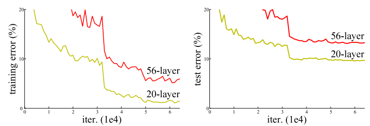

4. There exists a solution by construction to the deeper model: the added layers are identity mapping, and the other layers are copied from the learned shallower model. The existence of this constructed solution indicates that a deeper model should produce no higher training error than its shallower counterpart. But experiments show that our current solvers on hand are unable to find solutions that are comparably good or better than the constructed solution (or unable to do so in feasible time).


In this paper, we address the degradation problem by introducing a deep residual learning framework. Instead of hoping each few stacked layers directly fit a desired underlying mapping, we explicitly let these layers fit a residual mapping. 

- Formally, denoting the desired underlying mapping as $H(x)$, we let the stacked nonlinear layers fit another mapping of  (residual function)
  $$
  F(x) = H(x) - x
  $$
  (assuming that the input and output are of the same dimensions)

- The original mapping is recast into
  $$
  F(x) + x 
  $$

- We hypothesize that is easier to optimize the residual mapping than to optimize the original, unreferenced mapping. 

- To the extreme, if an identity mapping were optimal, it would be easier to push the residual to zero than to fit an identity mapping by a stack of nonlinear layers.

We show that: 

- 1) Our extremely deep residual nets are easy to optimize, but the counterpart “plain” nets (that simply stack layers) exhibit higher training error when the depth increases; 

- 2) Our deep residual nets can easily enjoy accuracy gains from greatly increased depth, producing re- sults substantially better than previous networks.


### Related Work

### Deep Residual Learning

#### Residual Learning

- The degradation problem suggests that the solvers might have difficulties in approximating identity mappings by multiple nonlinear layers.
- With the residual learning re- formulation, if identity mappings are optimal, the solvers may simply drive the weights of the multiple nonlinear lay- ers toward zero to approach identity mappings.
- the learned residual functions in general have small responses, suggesting that identity map- pings provide reasonable preconditioning.

#### Identity Mapping by Shortcuts

1. We adopt residual learning to every few stacked layers. A building block is shown in Fig. 2. Formally, in this paper we consider a building block defined as:

$$
y = F(x, W_i) + x
$$

 	Here $x$ and $y$ are the input and output vectors of the layers considered.  The function $F$ represents the 		residual mapping to be learned. For the example in Fig. 2. that has two layers,
$$
F = W_2 σ (W_1 x)
$$
​	in which σ denotes ReLU [29] and the biases are omitted for simplifying notations.  The operation F + x is performed by a shortcut connection and **element-wise addition**. **We adopt the second nonlinearity after the addition** (i.e., $σ(y)$, see Fig. 2). 

2. The shortcut connections in Eqn 5 introduce neither extra parameter nor computation complexity. This is not only attractive in practice but also important in our comparisons between plain and residual networks. We can fairly compare plain/residual networks that simultaneously have the same number of parameters, depth, width, and computational cost (except for the negligible element-wise addition).

3. The dimensions of x and F must be equal in Eqn.(1). If this is not the case (e.g., when changing the input/output channels), we can perform a linear projection $Ws$ by the shortcut connections to match the dimensions:


$$
   y = F(x, {W_i}) +W_s x
$$

4. We can also use a square matrix Ws in Eqn.(1). But we will show by experiments that the identity mapping is sufficient for addressing the degradation problem and is economical, and thus Ws is only used when matching dimensions.

5. The form of the residual function F is flexible. Experiments in this paper involve a function F that has two or three layers (Fig. 5), while more layers are possible. 

6. But if F has only a single layer, Eqn.(1) is similar to a linear layer: y = W1x+x, for which we have not observed advantages. 

7. We also note that although the above notations are about fully-connected layers for simplicity, they are applicable to convolutional layers. The function F(x, {Wi}) can represent multiple convolutional layers. The element-wise addition is performed on two feature maps, channel by channel.

#### Network Architectures

**Residual Network.** Based on the above plain network, we insert shortcut connections (Fig. 3, right) which turn the network into its counterpart residual version. The identity shortcuts (Eqn.(1)) can be directly used when the input and output are of the same dimensions (solid line shortcuts in Fig. 3). 

When the dimensions increase (dotted line shortcuts in Fig. 3), we consider two options: 

- (A) The shortcut still performs identity mapping, with extra zero entries padded for increasing dimensions. This option introduces no extra parameter; 
- (B) The projection shortcut in Eqn.(2) is used to options, when the shortcuts go across feature maps of two match dimensions (done by 1×1 convolutions). 
- For both options, when the shortcuts go across feature maps of two sizes, they are performed with a stride of 2.

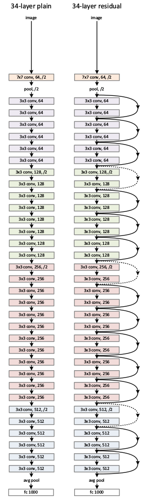

#### Implementation

Our implementation for ImageNet follows the practice in [21, 41]. 

- The image is resized with its shorter side randomly sampled in [256, 480] for scale augmentation [41]. 
- A 224×224 crop is randomly sampled from an image or its horizontal flip, **with the per-pixel mean subtracted** [21]. 
- The standard color augmentation in [21] is used. 
- We adopt batch normalization (BN) [16] right after each convolution and before activation, following [16]. 
- We initialize the weights as in [13] and train all plain/residual nets from scratch. 
- We use SGD with a mini-batch size of 256. 
- The learning rate starts from 0.1 and is divided by 10 when the error plateaus, and the models are trained for up to 60×104 iterations. 
- We use a weight decay of 0.0001 and a momentum of 0.9. 
- We do not use dropout [14], following the practice in [16]. 
- In testing, for comparison studies we adopt the standard 10-crop testing [21]. For best results, we adopt the fully- convolutional form as in [41, 13], and average the scores at multiple scales (images are resized such that the shorter side is in {224, 256, 384, 480, 640}).


### Experiments

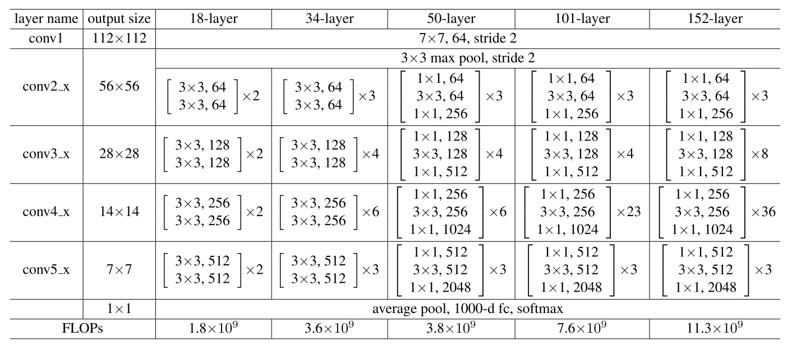

**Identity vs. Projection Shortcuts.**

We have shown that parameter-free, identity shortcuts help with training. Next we investigate projection shortcuts (Eqn.(2)). In Table 3 we compare three options: (A) zero-padding shortcuts are used for increasing dimensions, and all shortcuts are parameter- free (the same as Table 2 and Fig. 4 right); (B) projec- tion shortcuts are used for increasing dimensions, and other shortcuts are identity; and (C) all shortcuts are projections. (C>B>A)


**Deeper Bottleneck Architectures.** 

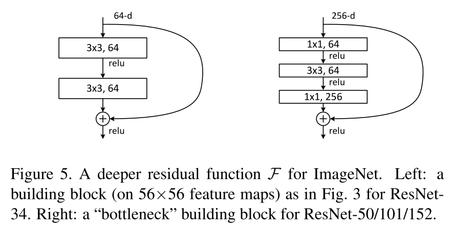

Next we describe our deeper nets for ImageNet. Because of concerns on the train- ing time that we can afford, we modify the building block use a stack of 3 layers instead of 2 (Fig. 5). The three layers as a bottleneck design4. For each residual function F, we are 1×1, 3×3, and 1×1 convolutions, where the 1×1 layers are responsible for reducing and then increasing (restoring) dimensions, leaving the 3×3 layer a bottleneck with smaller input/output dimensions. Fig. 5 shows an example, where **both designs have similar time complexity.** The parameter-free identity shortcuts are particularly important for the bottleneck architectures. If the identity shortcut in Fig. 5 (right) is replaced with projection, one can show that the time complexity and model size are doubled, as the shortcut is connected to the two high-dimensional ends. So identity shortcuts lead to more efficient models for the bottleneck designs.

**101-layer and 152-layer ResNets:** 

We construct 101-layer and 152-layer ResNets by using more 3-layer blocks (Table 1). Remarkably, although the depth is significantly increased, the 152-layer ResNet (11.3 billion FLOPs) still has lower complexity than VGG-16/19 nets (15.3/19.6 bil- lion FLOPs). 


## Identity Mappings in Deep Residual Networks


## Aggregated Residual Transformations for Deep Neural Networks


## InceptionV3


```python
keras.applications.inception_v3.InceptionV3(include_top=True, weights='imagenet', input_tensor=None, input_shape=None, pooling=None, classes=1000)
```

Inception V3 模型，权值由 ImageNet 训练而来。

该模型可同时构建于 `channels_first` (通道，高度，宽度) 和 `channels_last`（高度，宽度，通道）两种输入维度顺序。

模型默认输入尺寸是 299x299。

### 参数

- __include_top__: 是否包括顶层的全连接层。
- __weights__: `None` 代表随机初始化， `'imagenet'` 代表加载在 ImageNet 上预训练的权值。
- __input_tensor__: 可选，Keras tensor 作为模型的输入（即 `layers.Input()` 输出的 tensor）。
- __input_shape__: 可选，输入尺寸元组，仅当 `include_top=False` 时有效，否则输入形状必须是 `(299, 299, 3)`（对于 `channels_last` 数据格式），或者 `(3, 299, 299)`（对于 `channels_first` 数据格式）。它必须拥有 3 个输入通道，且宽高必须不小于 139。例如 `(150, 150, 3)` 是一个合法的输入尺寸。
- __pooling__: 可选，当 `include_top` 为 `False` 时，该参数指定了特征提取时的池化方式。
    - `None` 代表不池化，直接输出最后一层卷积层的输出，该输出是一个四维张量。
    - `'avg'` 代表全局平均池化（GlobalAveragePooling2D），相当于在最后一层卷积层后面再加一层全局平均池化层，输出是一个二维张量。
    - `'max'` 代表全局最大池化
- __classes__: 可选，图片分类的类别数，仅当 `include_top` 为 `True` 并且不加载预训练权值时可用。

### 返回值

一个 Keras `Model` 对象。

### 参考文献		

- [Rethinking the Inception Architecture for Computer Vision](http://arxiv.org/abs/1512.00567)

### License

预训练权值基于 [Apache License](https://github.com/tensorflow/models/blob/master/LICENSE)。


## GoogLeNet: Going deeper with convolutions
### Introduction

In the last three years, mainly due to the advances of deep learning, more concretely convolutional networks [10], the quality of image recognition and object detection has been progressing at a dra- matic pace. **One encouraging news is that most of this progress is not just the result of more powerful hardware, larger datasets and bigger models, but mainly a consequence of new ideas, algorithms and improved network architectures. **

1. Our GoogLeNet submission to ILSVRC 2014 actually uses 12× fewer parameters than the winning architecture of Krizhevsky et al [9] from two years ago, while being significantly more accurate. 
2. The biggest gains in object-detection have not come from the utilization of deep networks alone or bigger models, but from the synergy of deep architectures and classical computer vision, like the R-CNN algorithm by Girshick et al [6].

### Related Work

1. Starting with LeNet-5 [10], convolutional neural networks (CNN) have typically had a standard structure – stacked convolutional layers (optionally followed by contrast normalization and max- pooling) are followed by one or more fully-connected layers. Variants of this basic design are prevalent in the image classification literature and have yielded the best results to-date on MNIST, CIFAR and most notably on the ImageNet classification challenge [9, 21]. For larger datasets such as Imagenet, the recent trend has been to increase the number of layers [12] and layer size [21, 14], while using dropout [7] to address the problem of overfitting

2. Despite concerns that max-pooling layers result in loss of accurate spatial information, the same convolutional network architecture as [9] has also been successfully employed for localization [9, 14], object detection [6, 14, 18, 5] and human pose estimation [19].

3. in our setting, 1 × 1 convolutions have dual purpose: most critically, they are used mainly as dimension reduction modules to remove computational bottlenecks, that would otherwise limit the size of our networks. This allows for not just increasing the depth, but also the width of our networks without significant performance penalty.
4. The current leading approach for object detection is the Regions with Convolutional Neural Net- works (R-CNN) proposed by Girshick et al. [6]. R-CNN decomposes the overall detection problem into two subproblems: 
   - to first utilize low-level cues such as color and superpixel consistency for potential object proposals in a category-agnostic fashion
   - and to then use CNN classifiers to identify object categories at those locations.


### Motivation and High Level Considerations

The most straightforward way of improving the performance of deep neural networks is by increas- ing their size. This includes both increasing the depth – the number of levels – of the network and its width: the number of units at each level. This is as an easy and safe way of training higher quality models, especially given the availability of a large amount of labeled training data. However this simple solution comes with two major drawbacks.

- Bigger size typically means a larger number of parameters, which makes the enlarged network more prone to overfitting, especially if the number of labeled examples in the training set is limited. This can become a major bottleneck, since the creation of high quality training sets can be tricky and expensive.
- Another drawback of uniformly increased network size is the dramatically increased use of compu- tational resources. For example, in a deep vision network, **if two convolutional layers are chained, any uniform increase in the number of their filters results in a quadratic increase of computation.** If the added capacity is used inefficiently (for example, if most weights end up to be close to zero), then a lot of computation is wasted. Since in practice the computational budget is always finite, an efficient distribution of computing resources is preferred to an indiscriminate increase of size, even when the main objective is to increase the quality of results.
- The Inception architecture started out as a case study of the first author for assessing the hypothetical output of a sophisticated network topology construction algorithm that tries to approximate a sparse structure implied by [2] for vision networks and covering the hypothesized outcome by dense, read- ily available components.
- Inception architecture was especially useful in the context of localization and object detection as the base network for [6] and [5].

### Architecture Details

The main idea of the Inception architecture is based on finding out how an optimal local sparse structure in a convolutional vision network can be approximated and covered by readily available dense components. 

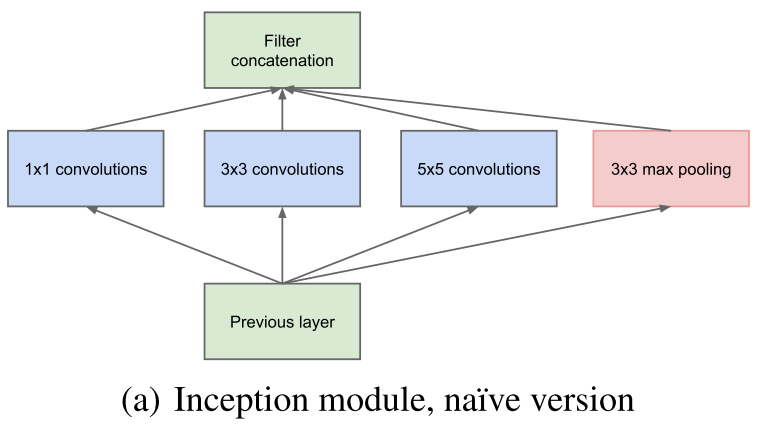

Note that assuming translation invariance means that our network will be built from convolutional building blocks. All we need is to find the optimal local construction and to repeat it spatially. 

- Arora et al. [2] suggests a layer-by layer construction in which one should analyze the correlation statistics of the last layer and cluster them into groups of units with high correlation. These clusters form the units of the next layer and are connected to the units in the previous layer. 

- We assume that each unit from the earlier layer corresponds to some region of the input image and these units are grouped into filter banks. 
- In the lower layers (the ones close to the input) correlated units would concentrate in local regions. This means, we would end up with a lot of clusters concentrated in a single region and **they can be covered by a layer of 1×1 convolutions in the next layer**, as suggested in [12]. 
- However, one can also expect that there will be a smaller number of more spatially spread out clusters that can be covered by convolutions over larger patches, and there will be a decreasing number of patches over larger and larger regions. 
- In order to avoid patch- alignment issues, current incarnations of the Inception architecture are restricted to filter sizes 1×1, 3×3 and 5×5, however this decision was based more on convenience rather than necessity. 
- It also means that the suggested architecture is a combination of all those layers with their output filter banks concatenated into a single output vector forming the input of the next stage. 
- Additionally, since pooling operations have been essential for the success in current state of the art convolutional networks, it suggests that adding an alternative parallel pooling path in each such stage should have additional beneficial effect, too (see Figure 2(a)).
- As these “Inception modules” are stacked on top of each other, their output correlation statistics are bound to vary: as features of higher abstraction are captured by higher layers, **their spatial concentration is expected to decrease suggesting that the ratio of 3×3 and 5×5 convolutions should increase as we move to higher layers.**

One big problem with the above modules, at least in this naive form, is that 

- even a modest number of 5×5 convolutions can be prohibitively expensive on top of a convolutional layer with a large number of filters. 
- This problem becomes even more pronounced once pooling units are added to the mix: their number of output filters equals to the number of filters in the previous stage. The merging of the output of the pooling layer with the outputs of convolutional layers would lead to an inevitable increase in the number of outputs from stage to stage. 
- Even while this architecture might cover the optimal sparse structure, it would do it very inefficiently, leading to a computational blow up within a few stages.


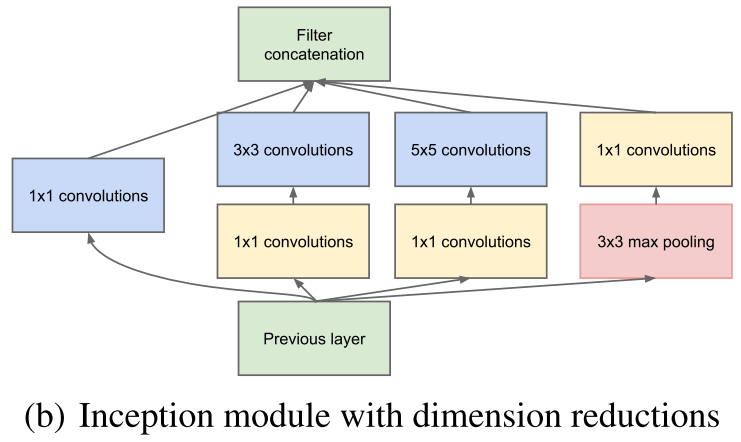

This leads to the second idea of the proposed architecture: judiciously applying dimension reductions and projections wherever the computational requirements would increase too much otherwise. 

This is based on the success of embeddings: even low dimensional embeddings might contain a lot of information about a relatively large image patch. However, embeddings represent information in a dense, compressed form and compressed information is harder to model. We would like to keep our representation sparse at most places (as required by the conditions of [2]) and compress the signals only whenever they have to be aggregated en masse. That is, 

- 1×1 convolutions are used to compute reductions before the expensive 3×3 and 5×5 convolutions. Besides being used as reductions, they also include the use of **rectified linear activation** which makes them dual-purpose. The final result is depicted in Figure 2(b).
- In general, an Inception network is a network consisting of modules of the above type stacked upon each other, with occasional max-pooling layers with stride 2 to halve the resolution of the grid. 
- For technical reasons (memory efficiency during training), it seemed beneficial to start using Inception modules only at higher layers while keeping the lower layers in traditional convolutional fashion. This is not strictly necessary, simply reflecting some infrastructural inefficiencies in our current implementation.

One of the main beneficial aspects of this architecture is that 

- it allows for increasing the number of units at each stage significantly without an uncontrolled blow-up in computational complexity. The ubiquitous use of dimension reduction allows for shielding the large number of input filters of the last stage to the next layer, first reducing their dimension before convolving over them with a large patch size. 
- Another practically useful aspect of this design is that **it aligns with the intuition that visual information should be processed at various scales and then aggregated so that the next stage can abstract features from different scales simultaneously.**
- The improved use of computational resources allows for increasing both the width of each stage as well as the number of stages without getting into computational difficulties. 
- Another way to utilize the inception architecture is to create slightly inferior, but computationally cheaper versions of it. We have found that all the included the knobs and levers allow for a controlled balancing of computational resources that can result in networks that are 2−3× faster than similarly performing networks with non-Inception architecture, however this requires careful manual design at this point.

不改变原有卷积核的大小和数量，但运算量和最后输出的深度大大减少！！

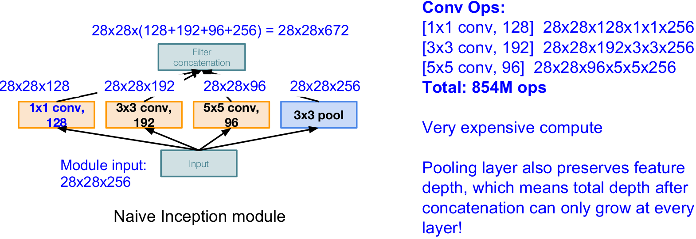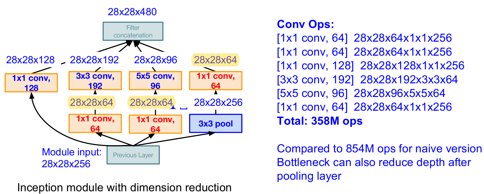

### GoogLeNet

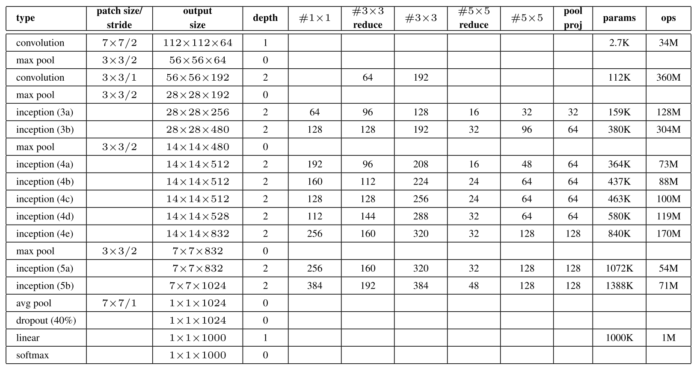

- All the convolutions, including those inside the Inception modules, use rectified linear activation. 
- The size of the receptive field in our network is 224×224 taking RGB color channels with mean subtraction. 
- “#3×3 reduce” and “#5×5 reduce” stands for the number of 1×1 filters in the reduction layer used before the 3×3 and 5×5 convolutions. 
- One can see the number of 1×1 filters in the projection layer after the built-in max-pooling in the pool proj column. 
- All these reduction/projection layers use rectified linear activation as well.

The network was designed with computational efficiency and practicality in mind, so that inference can be run on individual devices including even those with limited computational resources, especially with low-memory footprint. The network is 22 layers deep when counting only layers with parameters (or 27 layers if we also count pooling). The overall number of layers (independent building blocks) used for the construction of the network is about 100. 

- The use of average pooling before the classifier is based on [12], although our implementation differs in that we use an extra linear layer. This enables adapting and fine-tuning our networks for other label sets easily, but it is mostly convenience and we do not expect it to have a major effect. It was found that a move from fully connected layers to average pooling improved the top-1 accuracy by about 0.6%, however the use of dropout remained essential even after removing the fully connected layers.


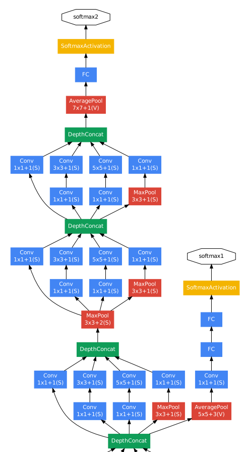

​                                                             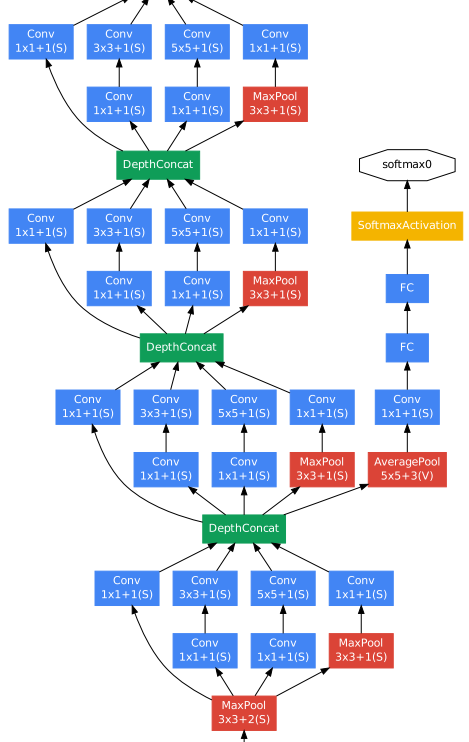

​                                                                                  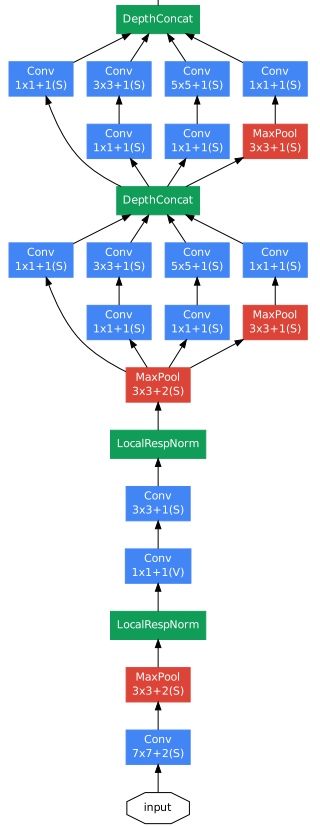


Given the relatively large depth of the network, the ability to propagate gradients back through all the layers in an effective manner was a concern. One interesting insight is that the strong performance of relatively shallower networks on this task suggests that the features produced by the layers in the middle of the network should be very discriminative. By adding auxiliary classifiers connected to these intermediate layers, we would expect to encourage discrimination in the lower stages in the classifier, increase the gradient signal that gets propagated back, and provide additional regulariza- tion. These classifiers take the form of smaller convolutional networks put on top of the output of the Inception (4a) and (4d) modules. During training, their loss gets added to the total loss of the network with a discount weight (the losses of the auxiliary classifiers were weighted by 0.3). At inference time, these auxiliary networks are discarded.

The exact structure of the extra network on the side, including the auxiliary classifier, is as follows:

- An average pooling layer with 5×5 filter size and stride 3, resulting in an 4×4×512 output for the (4a), and 4×4×528 for the (4d) stage.
- A 1×1 convolution with 128 filters for dimension reduction and rectified linear activation. 
- A fully connected layer with 1024 units and rectified linear activation. 
- A dropout layer with 70% ratio of dropped outputs. 
- A linear layer with softmax loss as the classifier (predicting the same 1000 classes as the main classifier, but removed at inference time).


### Training Methodology

Our training used asynchronous stochastic gradient descent with 0.9 momentum [17], fixed learning rate schedule (de- creasing the learning rate by 4% every 8 epochs). 


### ILSVRC 2014 Classification Challenge Setup and Results

We adopted a set of techniques during testing to obtain a higher performance, which we elaborate below.
1. We independently trained 7 versions of the same GoogLeNet model (including one wider version), and performed ensemble prediction with them. These models were trained with the same initialization (even with the same initial weights, mainly because of an oversight) and learning rate policies, and they only differ in sampling methodologies and the random order in which they see input images.
2. During testing, we adopted a more aggressive cropping approach than that of Krizhevsky et al. [9]. Specifically, we resize the image to 4 scales where the shorter dimension (height or width) is 256, 288, 320 and 352 respectively, take the left, center and right square of these resized images (in the case of portrait images, we take the top, center and bottom squares). For each square, we then take the 4 corners and the center 224×224 crop as well as **the square (original square)** resized to 224×224, and their mirrored versions. This results in 4×3×6×2 = 144 crops per image. A similar approach was used by Andrew Howard [8] in the previous year’s entry, which we empirically verified to perform slightly worse than the proposed scheme. We note that such aggressive cropping may not be necessary in real applications, as the benefit of more crops becomes marginal after a reasonable number of crops are present (as we will show later on).

3. The softmax probabilities are averaged over multiple crops and over all the individual clas- sifiers to obtain the final prediction. In our experiments we analyzed alternative approaches on the validation data, such as max pooling over crops and averaging over classifiers, but they lead to inferior performance than the simple averaging.

### ILSVRC 2014 Detection Challenge Setup and Results

### Conclusions


-----

## InceptionResNetV2


```python
keras.applications.inception_resnet_v2.InceptionResNetV2(include_top=True, weights='imagenet', input_tensor=None, input_shape=None, pooling=None, classes=1000)
```

Inception-ResNet V2 模型，权值由 ImageNet 训练而来。

该模型可同时构建于 `channels_first` (通道，高度，宽度) 和 `channels_last`（高度，宽度，通道）两种输入维度顺序。

模型默认输入尺寸是 299x299。

### 参数

- __include_top__: 是否包括顶层的全连接层。
- __weights__: `None` 代表随机初始化， `'imagenet'` 代表加载在 ImageNet 上预训练的权值。
- __input_tensor__: 可选，Keras tensor 作为模型的输入（即 `layers.Input()` 输出的 tensor）。
- __input_shape__: 可选，输入尺寸元组，仅当 `include_top=False` 时有效，否则输入形状必须是 `(299, 299, 3)`（对于 `channels_last` 数据格式），或者 `(3, 299, 299)`（对于 `channels_first` 数据格式）。它必须拥有 3 个输入通道，且宽高必须不小于 139。例如 `(150, 150, 3)` 是一个合法的输入尺寸。
- __pooling__: 可选，当 `include_top` 为 `False` 时，该参数指定了特征提取时的池化方式。
    - `None` 代表不池化，直接输出最后一层卷积层的输出，该输出是一个四维张量。
    - `'avg'` 代表全局平均池化（GlobalAveragePooling2D），相当于在最后一层卷积层后面再加一层全局平均池化层，输出是一个二维张量。
    - `'max'` 代表全局最大池化
- __classes__: 可选，图片分类的类别数，仅当 `include_top` 为 `True` 并且不加载预训练权值时可用。

### 返回值

一个 Keras `Model` 对象。

### 参考文献		

- [Inception-v4, Inception-ResNet and the Impact of Residual Connections on Learning](https://arxiv.org/abs/1602.07261)

### License

预训练权值基于 [Apache License](https://github.com/tensorflow/models/blob/master/LICENSE)。


## Inception-v4, Inception-ResNet and the Impact of Residual Connections on Learning

### Introduction

1. In this work we study the combination of the two most recent ideas: Residual connections introduced by He et al. in [5] and the latest revised version of the Inception archi- tecture [15]. In [5], it is argued that residual connections are of inherent importance for training very deep architectures. Since Inception networks tend to be very deep, it is natu- ral to replace the filter concatenation stage of the Inception architecture with residual connections. This would allow Inception to reap all the benefits of the residual approach while retaining its computational efficiency. 
2. Besides a straightforward integration, we have also studied whether Inception itself can be made more efficient by making it deeper and wider. For that purpose, we designed a new version named Inception-v4 which has a more uni- form simplified architecture and more inception modules than Inception-v3. Historically,
3. In the experimental section we demonstrate that it is not very difficult to train competitive very deep net- works without utilizing residual connections. However the use of residual connections seems to improve the training speed greatly, which is alone a great argument for their use.
4. The Inception deep convolutional architecture 
   - was introduced in [14] and was called GoogLeNet or Inception-v1 in our exposition. 
   - Later the Inception architecture was refined in various ways, first by the introduction of batch normalization [6] (Inception-v2) by Ioffe et al. 
   - Later the architecture was improved by additional factorization ideas in the third iteration [15] which will be referred to as Inception-v3 in this report.
5. 

### Architecture Choices

#### Pure Inception Blocks

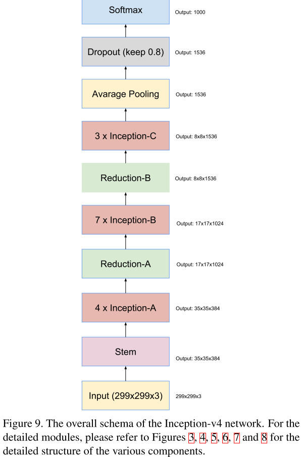


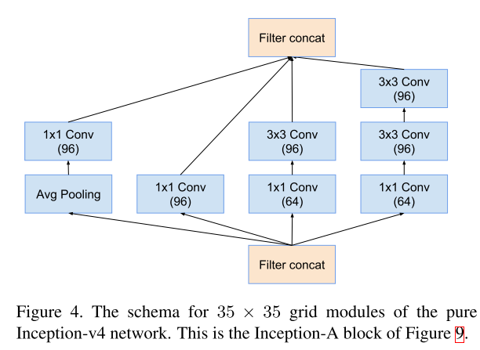


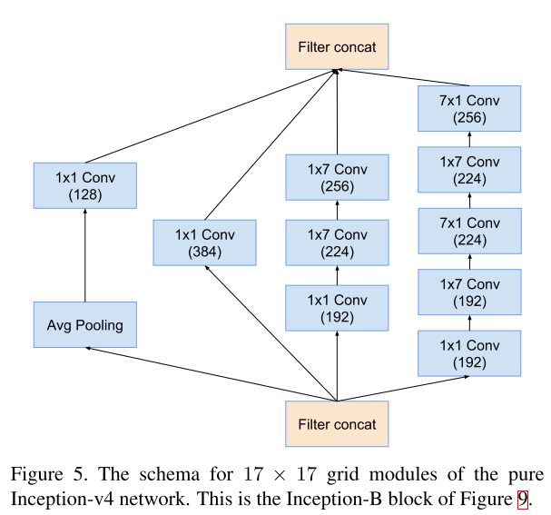

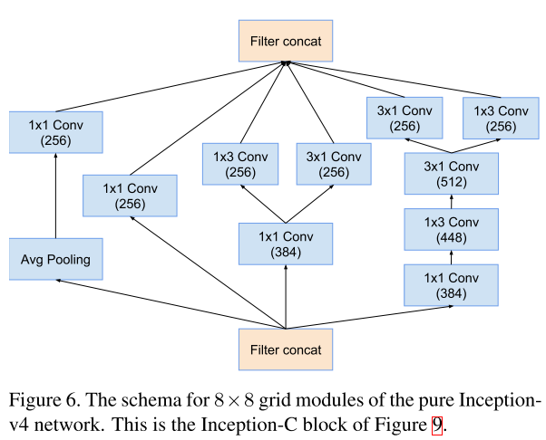

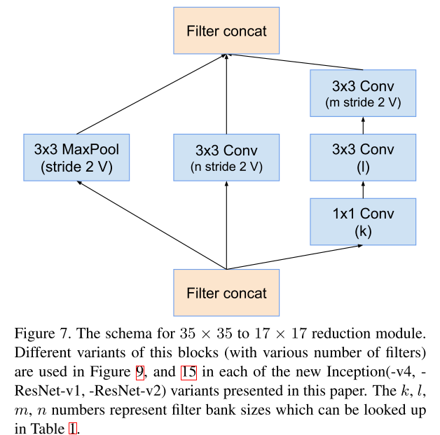

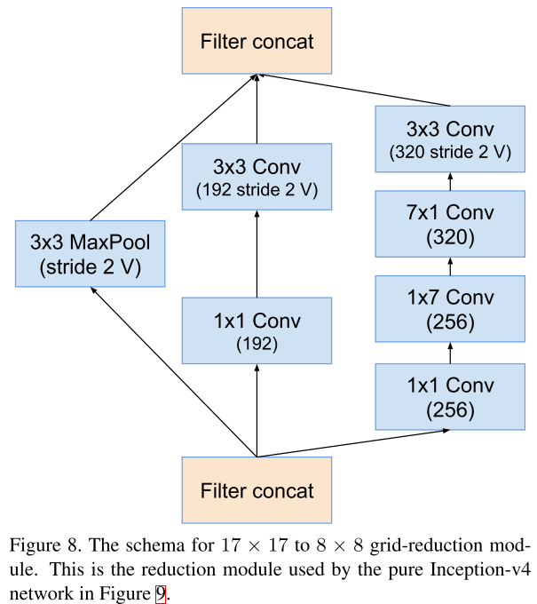


#### Residual Inception Blocks

1. For the residual versions of the Inception networks, we use cheaper Inception blocks than the original Inception. Each Inception block is followed by **filter-expansion layer** (1 × 1 convolution without activation) which is used for scaling up the dimensionality of the filter bank before the addition to match the depth of the input. This is needed to compensate for the dimensionality reduction induced by the Inception block.

2. We tried several versions of the residual version of Inception. Only two of them are detailed here. The first one “Inception-ResNet-v1” roughly the computational cost of Inception-v3, while “Inception-ResNet-v2” matches the raw cost of the newly introduced Inception-v4 network. See Figure 15 for the large scale structure of both varianets. (However, the step time of Inception-v4 proved to be signif- icantly slower in practice, probably due to the larger number of layers.)


   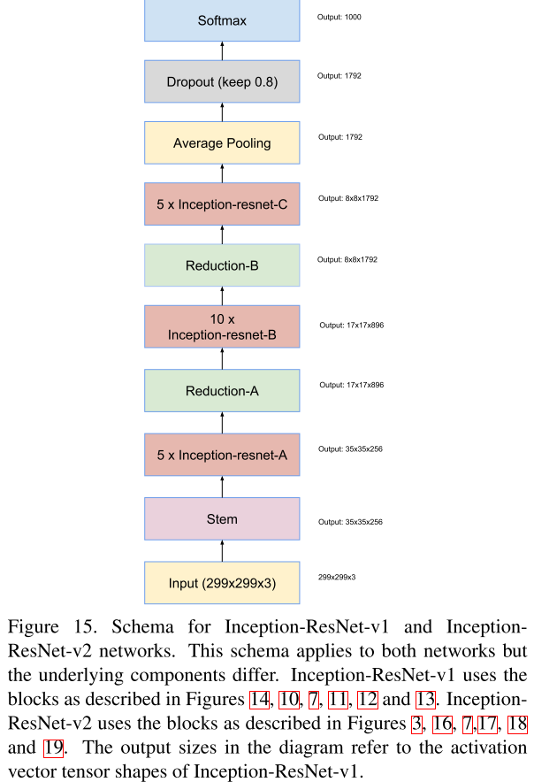


   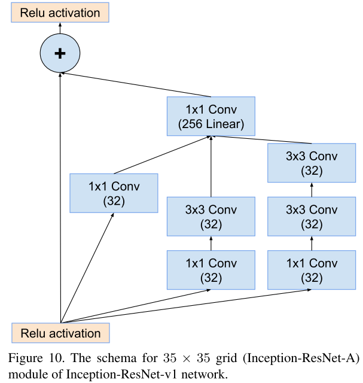

   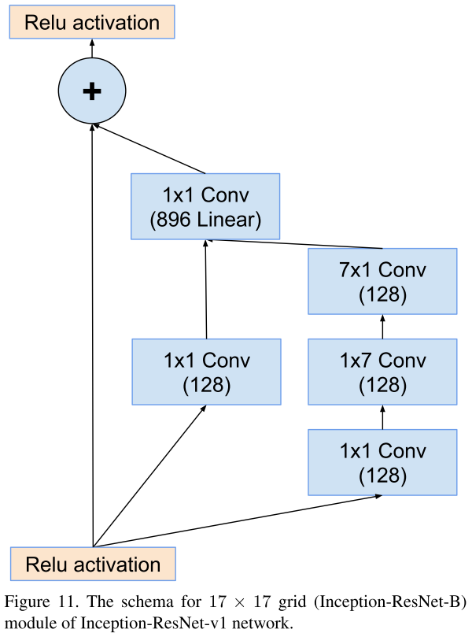

   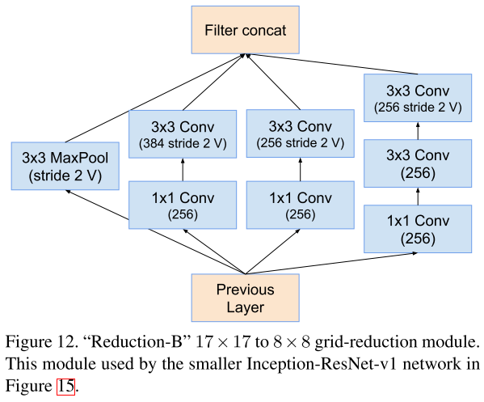

   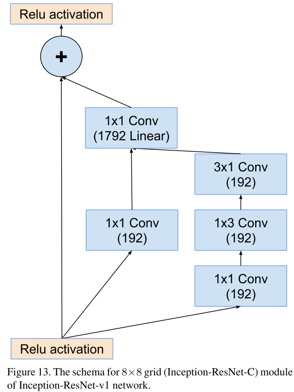

   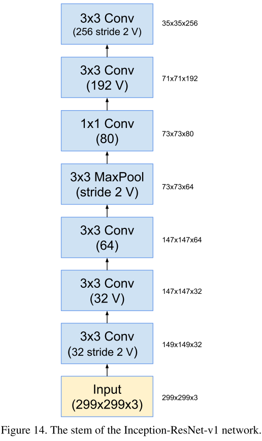


---


   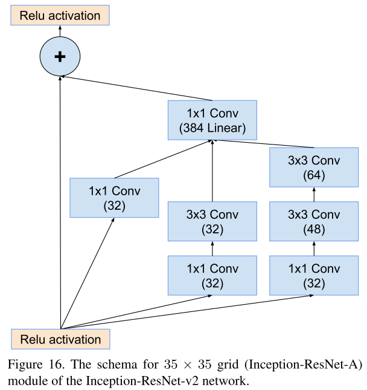

   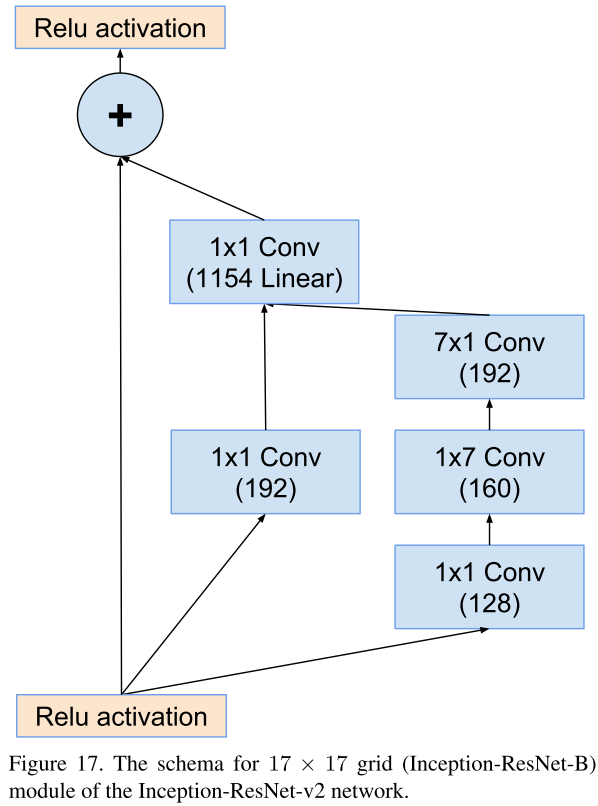

   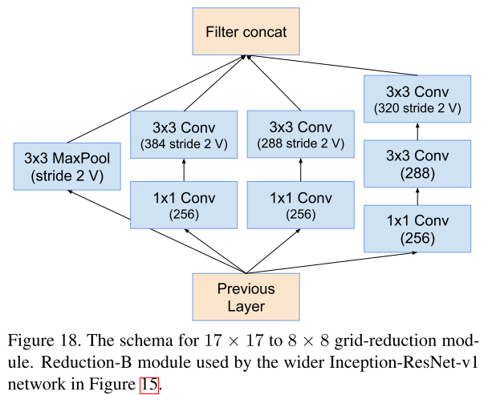

   


#### Scaling of the Residuals

Also we found that if the number of filters exceeded 1000, the residual variants started to exhibit instabilities and the network has just “died” early in the training, meaning that the last layer before the average pooling started to pro- duce only zeros after a few tens of thousands of iterations. This could not be prevented, neither by lowering the learn- ing rate, nor by adding an extra batch-normalization to this layer. 

We found that scaling down the residuals before adding them to the previous layer activation seemed to stabilize the training. In general we picked some scaling factors between 0.1 and 0.3 to scale the residuals before their being added to the accumulated layer activations (cf. Figure 20). 

A similar instability was observed by He et al. in [5] in the case of very deep residual networks and they suggested a two-phase training where the first “warm-up” phase is done with very low learning rate, followed by a second phase with high learning rata. We found that if the number of filters is very high, then even a very low (0.00001) learning rate is not sufficient to cope with the instabilities and the training with high learning rate had a chance to destroy its effects. We found it much more reliable to just scale the residuals. 

Even where the scaling was not strictly necessary, it never seemed to harm the final accuracy, but it helped to stabilize the training.

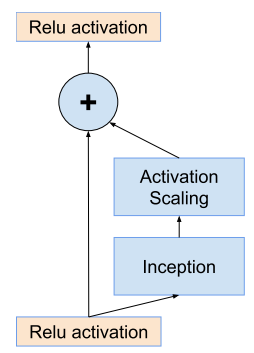


## Xception: Deep Learning with Depthwise Separable Convolutions

### Introduction

At this point a new style of network emerged, the Inception architecture, introduced by Szegedy et al. in 2014 [20] as GoogLeNet (Inception V1), later refined as Inception V2 [7], Inception V3 [21], and most recently Inception-ResNet [19]. Inception itself was inspired by the earlier Network- In-Network architecture [11]. Since its first introduction, Inception has been one of the best performing family of models on the ImageNet dataset [14], as well as internal datasets in use at Google, in particular JFT [5].

#### The Inception hypothesis


A convolution layer attempts to learn filters in a 3D space, with 2 spatial dimensions (width and height) and a channel dimension; thus a single convolution kernel is tasked with simultaneously mapping cross-channel correlations and spatial correlations. 

- This idea behind the Inception module is to make this process easier and more efficient by explicitly factoring it into a series of operations that would independently look at cross-channel correlations and at spatial correlations. 
- More precisely, the typical Inception module first looks at cross- channel correlations via a set of 1x1 convolutions, mapping the input data into 3 or 4 separate spaces that are smaller than the original input space, and then maps all correlations in these smaller 3D spaces, via regular 3x3 or 5x5 convolutions. 
- This is illustrated in figure 1. In effect, the fundamental hypothesis behind Inception is that cross-channel correlations and spatial correlations are sufficiently decoupled that it is preferable not to map them jointly .
- A variant of the process is to independently look at width-wise correlations and height-wise correlations. This is implemented by some of the modules found in Inception V3, which alternate 7x1 and 1x7 convolutions. The use of such spatially separable convolutions has a long history in image processing and has been used in some convolutional neural network implementations since at least 2012 (possibly earlier).


Consider a simplified version of an Inception module that only uses one size of convolution (e.g. 3x3) and does not include an average pooling tower (figure 2). This Inception module can be reformulated as **a large 1x1 convolution** followed by spatial convolutions that would operate on non- overlapping segments of the output channels (figure 3). This observation naturally raises the question: 

- what is the effect of the number of segments in the partition (and their size)? 
- Would it be reasonable to make a much stronger hypothesis than the Inception hypothesis, and assume that cross-channel correlations and spatial correlations can be mapped completely separately?


#### The continuum between convolutions and separable convolutions


An “extreme” version of an Inception module, based on this stronger hypothesis, would first use a 1x1 convolution to map cross-channel correlations, and would then separately map the spatial correlations of every output channel. This is shown in figure 4. We remark that this extreme form of an Inception module is almost identical to a **depthwise separable convolution**, an operation that has been used in neural TensorFlow and Keras, consists in a depthwise convolution, 

- i.e. a spatial convolution performed independently over each channel of an input, followed by a pointwise convolution, i.e. a 1x1 convolution, projecting the channels output by the depthwise convolution onto a new channel space. 
- This is not to be confused with a spatially separable convolution, which is also commonly called “separable convolution” in the image processing community. 

Two minor differences between and “extreme” version of an Inception module and a depthwise separable convolution would be:

- The order of the operations: depthwise separable convolutions as usually implemented (e.g. in TensorFlow) perform first channel-wise spatial convolution and then perform 1x1 convolution, whereas Inception performs the 1x1 convolution first.
- The presence or absence of a non-linearity after the first operation. In Inception, both operations are followed by a ReLU non-linearity, however depthwise separable convolutions are usually implemented without non-linearities.

**We argue that the first difference is unimportant, in particular because these operations are meant to be used in a stacked setting. The second difference might matter, and we investigate it in the experimental section (in particular see figure 10).**

We also note that other intermediate formulations of Inception modules that lie in between regular Inception modules and depthwise separable convolutions are also possible: 

- in effect, there is a discrete spectrum between regular convolutions and depthwise separable convolutions, parametrized by the number of independent channel-space segments used for performing spatial convolutions. 
- A regular convolution (preceded by a 1x1 convolution), at one extreme of this spectrum, corresponds to the single-segment case; 
- a depth- wise separable convolution corresponds to the other extreme where there is one segment per channel; 
- Inception modules lie in between, dividing a few hundreds of channels into 3 or 4 segments. The properties of such intermediate modules appear not to have been explored yet.

### The Xception Architecture

We propose a convolutional neural network architecture based entirely on depthwise separable convolution layers. In effect, we make the following hypothesis: that the map- ping of cross-channels correlations and spatial correlations in the feature maps of convolutional neural networks can be entirely decoupled. Because this hypothesis is a stronger version of the hypothesis underlying the Inception architecture, we name our proposed architecture Xception, which stands for “Extreme Inception”.


The Xception architecture has 36 convolutional layers forming the feature extraction base of the network. The 36 convolutional layers are structured into 14 modules, all of which have linear residual connections around them, except for the first and last modules.


### Experimental evaluation

#### Optimization configuration

A different optimization configuration was used for ImageNet and JFT: 

- On ImageNet:
  - Optimizer: SGD
  - Momentum: 0.9
  - Initial learning rate: 0.045
  - Learning rate decay: decay of rate 0.94 every 2 epochs
- On JFT:
  - Optimizer: RMSprop [22] 
  - Momentum: 0.9
  - Initial learning rate: 0.001
  - Learning rate decay: decay of rate 0.9 every 3,000,000 samples


#### Regularization configuration

- Weight decay: 

  The Inception V3 model uses a weight decay (L2 regularization) rate of 4e − 5, which has been carefully tuned for performance on ImageNet. We found this rate to be quite suboptimal for Xception and instead settled for 1e − 5. We did not perform an extensive search for the optimal weight decay rate. The same weight decay rates were used both for the ImageNet experiments and the JFT experiments.

  4.4.

- Dropout: 

  For the ImageNet experiments, both models include a dropout layer of rate 0.5 before the logistic regression layer. For the JFT experiments, no dropout was included due to the large size of the dataset which made overfitting unlikely in any reasonable amount of time.

- Auxiliary loss tower: 

  The Inception V3 architecture may optionally include an auxiliary tower which back- propagates the classification loss earlier in the network, serving as an additional regularization mechanism. For simplicity, we choose not to include this auxiliary tower in any of our models.

#### Effect of an intermediate activation after point- wise convolutions

We mentioned earlier that the analogy between depth-wise separable convolutions and Inception modules suggests that depthwise separable convolutions should potentially in- clude a non-linearity between the depthwise and pointwise operations. In the experiments reported so far, no such non- linearity was included. However we also experimentally tested the inclusion of either ReLU or ELU [3] as intermediate non-linearity. Results are reported on ImageNet in figure 10, and show that the absence of any non-linearity leads to both faster convergence and better final performance. This


------


-----

## MobileNet


```python
keras.applications.mobilenet.MobileNet(input_shape=None, alpha=1.0, depth_multiplier=1, dropout=1e-3, include_top=True, weights='imagenet', input_tensor=None, pooling=None, classes=1000)
```

在 ImageNet 上预训练的 MobileNet 模型。

注意，该模型目前只支持 `channels_last` 的维度顺序（高度、宽度、通道）。

模型默认输入尺寸是 224x224。

### 参数

- __input_shape__: 可选，输入尺寸元组，仅当 `include_top=False` 时有效，否则输入形状必须是 `(224, 224, 3)`（`channels_last` 格式）或 `(3, 224, 224)`（`channels_first` 格式）。它必须为 3 个输入通道，且宽高必须不小于 32，比如 `(200, 200, 3)` 是一个合法的输入尺寸。
- __alpha__: 控制网络的宽度：
    - 如果 `alpha` < 1.0，则同比例减少每层的滤波器个数。
    - 如果 `alpha` > 1.0，则同比例增加每层的滤波器个数。
    - 如果 `alpha` = 1，使用论文默认的滤波器个数
- __depth_multiplier__: depthwise卷积的深度乘子，也称为（分辨率乘子）
- __dropout__: dropout 概率
- __include_top__: 是否包括顶层的全连接层。
- __weights__: `None` 代表随机初始化， `'imagenet'` 代表加载在 ImageNet 上预训练的权值。
- __input_tensor__: 可选，Keras tensor 作为模型的输入（比如 `layers.Input()` 输出的 tensor）。
- __pooling__: 可选，当 `include_top` 为 `False` 时，该参数指定了特征提取时的池化方式。
    - `None` 代表不池化，直接输出最后一层卷积层的输出，该输出是一个四维张量。
    - `'avg'` 代表全局平均池化（GlobalAveragePooling2D），相当于在最后一层卷积层后面再加一层全局平均池化层，输出是一个二维张量。
    - `'max'` 代表全局最大池化
- __classes__: 可选，图片分类的类别数，仅当 `include_top` 为 `True` 并且不加载预训练权值时可用。

### 返回

一个 Keras `Model` 对象。

### 参考文献

- [MobileNets: Efficient Convolutional Neural Networks for Mobile Vision Applications](https://arxiv.org/pdf/1704.04861.pdf)

### License

预训练权值基于 [Apache License](https://github.com/tensorflow/models/blob/master/LICENSE)。


-----

## DenseNet


```python
keras.applications.densenet.DenseNet121(include_top=True, weights='imagenet', input_tensor=None, input_shape=None, pooling=None, classes=1000)
keras.applications.densenet.DenseNet169(include_top=True, weights='imagenet', input_tensor=None, input_shape=None, pooling=None, classes=1000)
keras.applications.densenet.DenseNet201(include_top=True, weights='imagenet', input_tensor=None, input_shape=None, pooling=None, classes=1000)
```

在 ImageNet 上预训练的 DenseNet 模型。

该模型可同时构建于 `channels_first` (通道，高度，宽度) 和 `channels_last`（高度，宽度，通道）两种输入维度顺序。

模型默认输入尺寸是 224x224。

### 参数

- __blocks__: 四个 Dense Layers 的 block 数量。
- __include_top__: 是否包括顶层的全连接层。
- __weights__: `None` 代表随机初始化， `'imagenet'` 代表加载在 ImageNet 上预训练的权值。
- __input_tensor__: 可选，Keras tensor 作为模型的输入（比如 `layers.Input()` 输出的 tensor）。
- input_shape: 可选，输入尺寸元组，仅当 `include_top=False` 时有效（不然输入形状必须是 `(224, 224, 3)` （`channels_last` 格式）或 `(3, 224, 224)` （`channels_first` 格式），因为预训练模型是以这个大小训练的）。它必须为 3 个输入通道，且宽高必须不小于 32，比如 `(200, 200, 3)` 是一个合法的输入尺寸。
- __pooling__: 可选，当 `include_top` 为 `False` 时，该参数指定了特征提取时的池化方式。
    - `None` 代表不池化，直接输出最后一层卷积层的输出，该输出是一个四维张量。
    - `'avg'` 代表全局平均池化（GlobalAveragePooling2D），相当于在最后一层卷积层后面再加一层全局平均池化层，输出是一个二维张量。
    - `'max'` 代表全局最大池化.
- __classes__: 可选，图片分类的类别数，仅当 `include_top` 为 `True` 并且不加载预训练权值时可用。

### 返回

一个 Keras `Model` 对象。

### 参考文献

- [Densely Connected Convolutional Networks](https://arxiv.org/abs/1608.06993) (CVPR 2017 Best Paper Award)

### Licence

预训练权值基于 [BSD 3-clause License](https://github.com/liuzhuang13/DenseNet/blob/master/LICENSE)。


## Densely Connected Convolutional Networks

*Gao Huang∗ Cornell University gh349@cornell.edu*

*Zhuang Liu∗ Tsinghua University liuzhuang13@mails.tsinghua.edu.cn*

*Laurens van der Maaten Facebook AI Research lvdmaaten@fb.com*

*Kilian Q. Weinberger Cornell University kqw4@cornell.edu*


### Abstract (Awesome abstract template)

1. Recent work has shown that convolutional networks can be substantially deeper, more accurate, and efficient to train **if they contain shorter connections between layers close to the input and those close to the output**. 
2. In this paper, we embrace this observation and introduce the Dense Convolutional Network (DenseNet), which connects each layer to every other layer in a feed-forward fashion. Whereas traditional convolutional networks with L layers have L connections—one between each layer and its subsequent layer—our network has $\frac{L(L+1)}{ 2}$ direct connections. 
   - **Fore each layer, the feature-maps of all preceding layers are used as inputs, and its own feature-maps are used as inputs into all subsequent layers.** 
3. DenseNets have several compelling **advantages**: 
   - they alleviate(缓和) the vanishing-gradient problem, 
   - strengthen feature propagation, 
   - encourage feature reuse, 
   - and substantially reduce the number of parameters. 
4. We evaluate our proposed architecture on four highly competitive object recognition benchmark tasks (CIFAR-10, CIFAR-100, SVHN, and ImageNet). DenseNets obtain significant improvements over the state-of-the-art on most of them, whilst requiring less computation to achieve high performance. Code and pretrained models are available at https://github.com/liuzhuang13/DenseNet.


### 1. Introduction

**The history of CNNs:**

Convolutional neural networks (CNNs) have become the dominant machine learning approach for visual object recognition. Although they were originally introduced over 20 years ago [18], improvements in computer hardware and network structure have enabled the training of truly deep CNNs only recently. The original LeNet5 [19] consisted of 5 layers, VGG featured 19 [29], and only last year Highway Networks [34] and Residual Networks (ResNets) [11] have surpassed the 100-layer barrier.


As CNNs become increasingly deep, **a new research problem emerges:** 

as information about the input or gradient passes through many layers, it can vanish and “wash out” by the time it reaches the end (or beginning) of the network. Many recent publications address this or related problems. 

- ResNets [11] and Highway Networks [34] bypass signal from one layer to the next via **identity connections**. 
- Stochastic depth [13] shortens ResNets by **randomly dropping layers** during training to allow better information and gradient flow. 
- FractalNets [17] repeatedly combine several **parallel layer sequences with different number of convolutional blocks** to obtain a large nominal depth, while maintaining many short paths in the network. 

Although these different approaches vary in network topology and training procedure, they all share a key characteristic: **they create short paths from early layers to later layers.**


In this paper, we propose an architecture that distills(提纯) this insight into a simple connectivity pattern: 

- to ensure maximum information flow between layers in the network, we connect all layers (with matching feature-map sizes) directly with each other. 

- To preserve the feed-forward nature, each layer obtains additional inputs from all preceding layers and passes on its own feature-maps to all subsequent layers. 

- Figure 1 illustrates this layout schematically. 

- Crucially, in contrast to ResNets, we never combine features through summation before they are passed into a layer; instead, **we combine features by concatenating them.** Hence, the $l^{th}$ layer has $l$ inputs, consisting of the feature-maps of all preceding convolutional blocks. Its own feature-maps are passed on to all $L−l$ subsequent layers. This introduces $\frac{L(L+1)}{ 2}$  connections in an L-layer network, instead of just L, as in traditional architectures. 

- Because of its dense connectivity pattern, we refer to our approach as *Dense Convolutional Network (DenseNet).*

  

*Figure 1: A 5-layer dense block with a growth rate of k = 4. Each layer takes all preceding feature-maps as input.*


**Advantages:**

- A possibly **counter-intuitive** effect of this dense connectivity pattern is that it requires fewer parameters than traditional convolutional networks, as there is no need to relearn **redundant feature-maps**. 
  - Traditional feed-forward architectures can be viewed as algorithms with a state, which is passed on from layer to layer. Each layer reads the state from its preceding layer and writes to the subsequent layer. It changes the state but also passes on information that needs to be preserved. 
  - ResNets [11] make this information preservation explicit through additive identity transformations. 
  - Recent variations of ResNets [13] show that many layers contribute very little and can in fact be randomly dropped during training. This makes the state of ResNets similar to (unrolled) recurrent neural networks [21], but the number of parameters of ResNets is substantially larger because each layer has its own weights. 

- DenseNet layers are very narrow (e.g., 12 filters per layer), adding only a small set of feature-maps to the “collective knowledge” of the network and keep the remaining feature maps unchanged—**and the final classifier makes a decision based on all feature-maps in the network.** 
- Besides better parameter efficiency, one big advantage of DenseNets is their improved flow of information and gradients throughout the network, which makes them easy to train. 
  - Each layer has direct access to the gradients from the loss function and the original input signal, leading to an implicit deep supervision [20]. This helps training of deeper network architectures. 
- Further, we also observe that dense connections have a regularizing effect, which reduces over- fitting on tasks with smaller training set sizes.


**Experiments：**

- We evaluate DenseNets on four highly competitive benchmark datasets (CIFAR-10, CIFAR-100, SVHN, and ImageNet). Our models tend to require much fewer parameters than existing algorithms with comparable accuracy. 
- Further, we significantly outperform the current state-of- the-art results on most of the benchmark tasks.


### 2. Related Work

- A cascade structure similar to our proposed dense network layout has already been studied in the neural networks literature in the 1980s [3]. Their pioneering work focuses on fully connected multi-layer perceptrons trained in a layer- by-layer fashion. More recently, fully connected cascade networks to be trained with batch gradient descent were proposed [40]. Although effective on small datasets, this approach only scales to networks with a few hundred parameters. 
- In [9, 23, 31, 41], utilizing multi-level features in CNNs through skip-connnections has been found to be effective for various vision tasks. Parallel to our work, [1] derived a purely theoretical framework for networks with cross-layer connections similar to ours. 
- Highway Networks [34] were amongst the first architectures that provided a means to effectively train end-to-end networks with more than 100 layers. Using bypassing paths along with gating units, Highway Networks with hundreds of layers can be optimized without difficulty. The bypassing paths are presumed to be the key factor that eases the training of these very deep networks. This point is further supported by ResNets [11], in which pure identity mappings are used as bypassing paths. ResNets have achieved impressive, record-breaking performance on many challenging image recognition, localization, and detection tasks, such as ImageNet and COCO object detection [11]. 
- Recently, stochastic depth was proposed as a way to successfully train a 1202-layer ResNet [13]. Stochastic depth improves the training of deep residual networks by dropping layers randomly during training. This shows that not all layers may be needed and highlights that there is a great amount of redundancy in deep (residual) networks. Our paper was partly inspired by that observation. ResNets with pre-activation also facilitate the training of state-of-the-art networks with > 1000 layers [12]. 
- An orthogonal approach to making networks deeper (e.g., with the help of skip connections) is to increase the network width. The GoogLeNet [36, 37] uses an “Inception module” which concatenates feature-maps produced by filters of different sizes. 
- In [38], a variant of ResNets with wide generalized residual blocks was proposed. In fact, simply increasing the number of filters in each layer of ResNets can improve its performance provided the depth is sufficient [42]. FractalNets also achieve competitive results on several datasets using a wide network structure [17]. 


**The comparisons of DenseNets with others:**

- Instead of drawing representational power from extremely deep or wide architectures, DenseNets exploit the potential of the network through feature reuse, yielding condensed models that are easy to train and highly parameter- efficient. 
- Concatenating feature-maps learned by different layers increases variation in the input of subsequent layers and improves efficiency. This constitutes a major difference between DenseNets and ResNets. 
- Compared to Inception networks [36, 37], which also concatenate features from different layers, DenseNets are simpler and more efficient.


Other notable network architecture innovations:

- The Network in Network (NIN) [22] structure includes micro multi-layer perceptrons into the filters of convolutional layers to extract more complicated features. 
- In Deeply Supervised Network (DSN) [20], internal layers are directly supervised by auxiliary classifiers, which can strengthen the gradients received by earlier layers. 
- Ladder Networks [27, 25] introduce lateral connections into autoencoders, producing impressive accuracies on semi-supervised learning tasks. 
- In [39], Deeply-Fused Nets (DFNs) were proposed to improve information flow by combining intermediate layers of different base networks. The augmentation of networks with pathways that minimize reconstruction losses was also shown to improve image classification models [43].


### 3. DenseNets

Consider a single image $\bold{x}_0$ that is passed through a convolutional network. The network comprises $L$ layers, each of which implements a non-linear transformation $H_l(·)$, where $l$ indexes the layer. **$H_l (·)$ can be a composite function of operations such as Batch Normalization (BN) [14], rectified linear units (ReLU) [6], Pooling [19], or Convolution (Conv).** 

Note:

- We denote the output of the $l^{th}$ layer as $\bold {x}_l$.


**Traditional:**

Traditional convolutional feed-forward networks connect the output of the $l^{th}$ layer as input to the $ (l+ 1)^{th}$ layer [16], which gives rise to the following layer transition: 
$$
x_l = H_l (x_{l−1})
$$


**ResNets** 

ResNets [11] add a skip-connection that bypasses the non-linear transformations with an identity function: 
$$
\bold{x}_l = H_l(\bold{x}_{l-1}) + \bold{x}_{l-1}
$$

- An advantage of ResNets is that the gradient can flow directly through the identity function from later layers to the earlier layers (fit H to be zero). 

- However, the identity function and the output of $H_l$ are combined by summation, **which may impede the information flow in the network.**


**Dense connectivity**

To further improve the information flow between layers we propose a different connectivity pattern: we introduce direct connections from any layer to all subsequent layers. Consequently, the $l^{th}$ layer receives the feature-maps of all preceding layers, $x0, . . . , x_{l−1}$, as input:
$$
x_l = H_l ([x_o, x_1, \ldots , x_{l-1}])
$$
where $[x_o, x_1, \ldots , x_{l-1}]$ refers tot the concatenation of the feature maps produced in layers $0, \ldots, l-1$. For ease of implementation, we concatenate the multiple inputs of $H_l(·)$ in eq. (2) into a single tensor.


**Composite function**

Motivated by [12], we define H(·) as a composite function of three consecutive operations: 

- batch normalization (BN) [14], 
- followed by a rectified linear unit (ReLU) [6] 
- and a 3 × 3 convolution (Conv).


**Pooling layers**

The concatenation operation used in Eq. (2) is not viable when the size of feature-maps changes. However, an essential part of convolutional networks is down-sampling layers that change the size of feature-maps. To facilitate down-sampling in our architecture we divide the network into multiple densely connected dense blocks; see Figure 2. We refer to layers between blocks as **transition layers**, which do convolution and pooling. The transition layers used in our experiments consist of 

- a batch normalization layer 
- and an 1×1 convolutional layer 
- followed by a 2×2 average pooling layer.

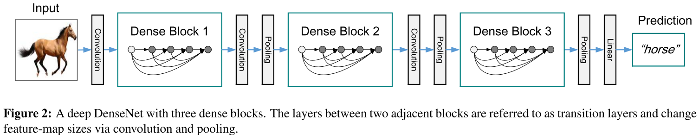


**Growth rate**

If each function $H_l$ produces k feature-maps, it follows that the $l_{th}$ layer has 
$$
k_o + k(l-1)
$$
**input feature-maps**, where k0 is the number of channels in the input layer. 

An important difference between DenseNet and existing network architectures is that DenseNet **can have very narrow layers, e.g., k = 12.**  (the number of filters) We refer to the hyper-parameter k as the growth rate of the network.

- We show in Section 4 that **a relatively small growth rate is sufficient to obtain state-of-the-art results** on the datasets that we tested on. 
- One explanation for this is that each layer has access to all the preceding feature-maps in its block and, therefore, to the network’s “collective knowledge”. One can view the feature-maps as the global state of the network. Each layer adds k feature-maps of its own to this state. 
- **The growth rate regulates how much new information each layer contributes to the global state.** The global state, once written, can be accessed from everywhere within the network and, unlike in traditional network architectures, there is no need to replicate it from layer to layer.


**Bottleneck layers:**

Although each layer only produces $k$ output feature-maps, it typically has many more inputs. It has been noted in [37, 11] that **a 1×1 convolution can be introduced as bottleneck layer before each 3×3 convolution to reduce the number of input feature-maps**, and thus to improve computational efficiency. We find this design especially effective for DenseNet and we refer to our network with such a bottleneck layer, i.e., to the 

```bash
BN-ReLU-Conv(1× 1)-BN-ReLU-Conv(3×3) 
```

version of $H_l$, as DenseNet-B. 

In our experiments, **we let each 1×1 convolution produce $4k$ feature-maps.**


**Compression.** 

To further improve model compactness, we can reduce the number of feature-maps at transition layers. If a dense block contains $m$ feature-maps, we let the following transition layer generate $\lfloor θm \rfloor$ output feature- maps, where $0 <θ ≤1$ is referred to as the compression factor. 

- When $θ=1$, the number of feature-maps across transition layers remains unchanged. 
- We refer the DenseNet with θ<1 as DenseNet-C, and **we set θ = 0.5 in our experiment**. 
- When both the bottleneck and transition layers with θ < 1 are used, we refer to our model as **DenseNet-BC.**


**Implementation Details**

On all datasets except ImageNet, the DenseNet used in our experiments has **three dense blocks that each has an equal number of layers.** 

- Before entering the first dense block, a convolution with 16 (**or twice the growth rate** for DenseNet-BC) output channels is performed on the input images. For convolutional layers with kernel size 3×3, each side of the inputs is **zero-padded** by one pixel to keep the feature-map size fixed. 
- We use 1×1 convolution followed by 2×2 average pooling as transition layers between two contiguous dense blocks. 
- At the end of the last dense block, a global average pooling is performed and then a softmax classifier is attached. The feature-map sizes in the three dense blocks are 32× 32, 16×16, and 8×8, respectively. 
- We experiment with the **basic DenseNet structure** with configurations {L = 40, k = 12}, {L = 100, k = 12} and {L = 100, k = 24}. 
- For DenseNet- BC, the networks with configurations {L = 100, k = 12}, {L=250, k=24} and {L=190, k=40} are evaluated.
- In our experiments on ImageNet, we use a DenseNet-BC structure with 4 dense blocks on 224×224 input images. 
  - The initial convolution layer comprises $2k$ convolutions of size 7×7 with stride 2; 
  - the number of feature-maps in all other layers also follow from setting $k$. (1x1 conv filter is 4K) 
  - The exact network configurations we used on ImageNet are shown in Table 1.

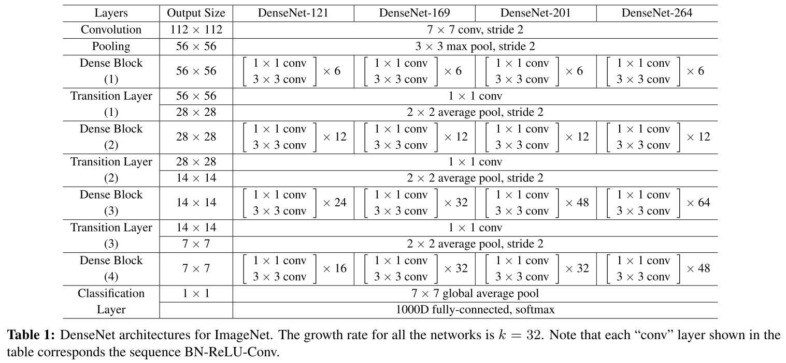


### 4. Experiments

#### 4.1 Datesets

**CIFAR**

The two CIFAR datasets [15] consist of colored natural images with 32×32 pixels. CIFAR-10 (C10) consists of images drawn from 10 and CIFAR-100 (C100) from 100 classes. The training and test sets contain 50,000 and 10,000 images respectively, and we hold out 5,000 training images as a validation set. 

- We adopt a standard data augmentation scheme (mirroring/shifting) that is widely used for these two datasets [11, 13, 17, 22, 28, 20, 32, 34]. We denote this data augmentation scheme by a “+” mark at the end of the dataset name (e.g., C10+). 
- For preprocessing, we **normalize** the data using the channel means and standard deviations. 
- For the final run we use all 50,000 training images and report the final test error at the end of training.

**SVHN**

The Street View House Numbers (SVHN) dataset [24] contains 32×32 colored digit images. There are 73,257 images in the training set, 26,032 images in the test set, and 531,131 images for additional training. 

- Following common practice [7, 13, 20, 22, 30] we use all the training data without any data augmentation, and a validation set with 6,000 images is split from the training set. 
- **We select the model with the lowest validation error during training and report the test error.** We follow [42] and divide the pixel values by 255 so they are in the [0, 1] range.

**ImageNet**

The ILSVRC 2012 classification dataset [2] consists 1.2 million images for training, and 50,000 for validation, from 1, 000 classes. 

- We adopt the same data augmentation scheme for training images as in [8, 11, 12], and apply a single-crop or 10-crop with size 224×224 at test time. Following [11, 12, 13], we report classification errors on the validation set.

#### 4.2 Training

All the networks are trained using stochastic gradient descent (**SGD**). 

- On CIFAR and SVHN we train using batch size 64 for 300 and 40 epochs, respectively. The initial learning rate is set to 0.1, and is divided by 10 at 50% and 75% of the total number of training epochs. 
- On ImageNet, we train models for 90 epochs with a batch size of 256. The learning rate is set to 0.1 initially, and is lowered by 10 times at epoch 30 and 60. 
- Note that a naive implementation of DenseNet may contain memory inefficiencies. To reduce the memory consumption on GPUs, **please refer to our technical report on the memory-efficient implementation of DenseNets [26].** 
- Following [8], we use a **weight decay of 10−4 and a Nesterov momentum [35] of 0.9 without dampening**. 
- We adopt the **weight initialization introduced by [10]**. 
- For the three datasets without data augmentation, i.e., C10, C100 and SVHN, we add a **dropout layer [33] after each convolutional layer** (except the first one) and **set the dropout rate to 0.2**. The test errors were only evaluated once for each task and model setting.

#### 4.3 Classification Results on CIFAR and SVHN

We train DenseNets with different depths, L, and growth rates, k. The main results on CIFAR and SVHN are shown in Table 2. To highlight general trends, we mark all results that outperform the existing state-of-the-art in boldface and the overall best result in blue.


**Accuracy：**

- Possibly the most noticeable trend may originate from the bottom row of Table 2, which shows that DenseNet-BC with L = 190 and k = 40 outperforms the existing state-of-the-art consistently on all the CIFAR datasets. Its error rates of 3.46% on C10+ and 17.18% on C100+ are significantly lower than the error rates achieved by wide ResNet architecture [42]. 
- Our best results on C10 and C100 (without data augmentation) are even more encouraging: both are close to 30% lower than Fractal-Net with drop-path regularization [17]. 
- On SVHN, with dropout, the DenseNet with L = 100 and k = 24 also surpasses the current best result achieved by wide ResNet. However, the 250-layer DenseNet-BC doesn’t further improve the performance over its shorter counterpart. **This may be explained by that SVHN is a relatively easy task, and extremely deep models may overfit to the training set.**

**Capacity：**  

- Without compression or bottleneck layers, there is a general trend that DenseNets perform better as L and k increase. We attribute this primarily to the corresponding growth in model capacity. This is best demonstrated by the column of C10+ and C100+. On C10+, the error drops from 5.24% to 4.10% and finally to 3.74% as the number of parameters increases from 1.0M, over 7.0M to 27.2M. On C100+, we observe a similar trend. This suggests that DenseNets can utilize the increased representational power of bigger and deeper models. It also indicates that they do not suffer from overfitting or the optimization difficulties of residual networks [11].

**Overfitting：**

One positive side-effect of the more efficient use of parameters is a tendency of DenseNets to be less prone to overfitting. We observe that on the datasets without data augmentation, the improvements of DenseNet architectures over prior work are particularly pronounced. On C10, the improvement denotes a 29% relative reduction in error from 7.33% to 5.19%. On C100, the reduction is about 30% from 28.20% to 19.64%. 

In our experiments, we observed potential overfitting in a single setting: on C10, a 4× growth of parameters produced by increasing k=12 to k=24 lead to a modest increase in error from 5.77% to 5.83%. **The DenseNet-BC bottleneck and compression layers appear to be an effective way to counter this trend.**

#### 4.4 Classification Results on ImageNet

We evaluate DenseNet-BC with different depths and growth rates on the ImageNet classification task, and compare it with state-of-the-art ResNet architectures. To ensure a fair comparison between the two architectures, we eliminate all other factors such as differences in data preprocessing and optimization settings by adopting the publicly available Torch implementation for ResNet by [8].

We simply replace the ResNet model with the DenseNet- BC network, and **keep all the experiment settings exactly the same as those used for ResNet.** We report the single-crop and 10-crop validation errors of DenseNets on ImageNet in Table 3. 

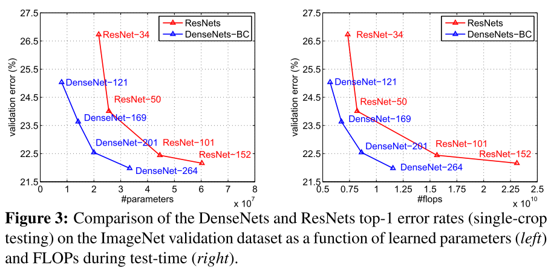

Figure 3 shows the single-crop top-1 validation errors of DenseNets and ResNets as a function of the number of parameters (left) and FLOPs (right). The results presented in the figure reveal that DenseNets perform on par with the state-of-the-art ResNets, whilst requiring significantly fewer parameters and computation to achieve comparable performance. For example, a DenseNet-201 with 20M parameters model yields similar validation error as a 101-layer ResNet with more than 40M parameters. 

Similar trends can be observed from the right panel, which plots the validation error as a function of the number of FLOPs: a DenseNet that requires as much computation as a ResNet-50 performs on par with a ResNet-101, which requires twice as much computation. It is worth noting that our experimental setup implies that we use hyperparameter settings that are optimized for ResNets but not for DenseNets. It is conceivable that more extensive hyper-parameter searches may further improve the performance of DenseNet on ImageNet.


### 5. Discussion

Superficially, DenseNets are quite similar to ResNets: Eq. (2) differs from Eq. (1) only in that the inputs to H?(·) are concatenated instead of summed. However, the implications of this seemingly small modification lead to substantially different behaviors of the two network architectures.

**Model compactness：** 

As a direct consequence of the in- put concatenation, the feature-maps learned by any of the DenseNet layers can be accessed by all subsequent layers. This encourages feature reuse throughout the network, and leads to more compact models. The left two plots in Figure 4 show the result of an experiment that aims to compare the parameter efficiency of all variants of DenseNets (left) and also a comparable
ResNet ResNet architecture (middle). 

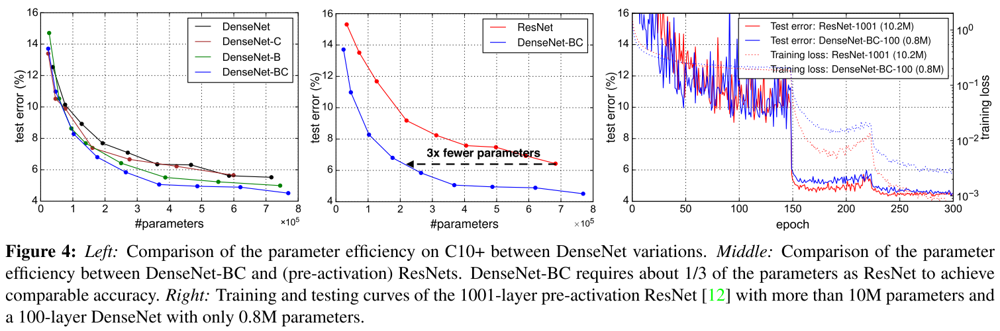

We train multiple small networks with varying depths on C10+ and plot their test accuracies as a function of network parameters. In comparison with other popular network architectures, such as AlexNet [16] or VGG-net [29], ResNets with pre-activation use fewer parameters while typically achieving better results [12]. Hence, we compare DenseNet (k = 12) against this architecture. The training setting for DenseNet is kept the same as in the previous section. 

The graph shows that DenseNet-BC is consistently the most parameter efficient variant of DenseNet. Further, to achieve the same level of accuracy, DenseNet-BC only re- quires around 1/3 of the parameters of ResNets (middle plot). This result is in line with the results on ImageNet we presented in Figure 3. The right plot in Figure 4 shows that a DenseNet-BC with only 0.8M trainable parameters is able to achieve comparable accuracy as the 1001-layer (pre-activation) ResNet [12] with 10.2M parameters

**Implicit Deep Supervision:**

One explanation for the improved accuracy of dense convolutional networks may be that individual layers receive additional supervision from the loss function through the shorter connections.

One can interpret DenseNets to perform a kind of “deep supervision”. The benefits of deep supervision have previously been shown in deeply-supervised nets (DSN; [20]), which have classifiers attached to every hidden layer, enforcing the intermediate layers to learn discriminative features. 

DenseNets perform a similar deep supervision in an implicit fashion: a single classifier on top of the network provides direct supervision to all layers through at most two or three transition layers. However, the loss function and gradient of DenseNets are substantially less complicated, as the same loss function is shared between all layers.

**Stochastic vs. deterministic connection:** 

There is an interesting connection between dense convolutional networks and stochastic depth regularization of residual networks [13]. 

In stochastic depth, layers in residual networks are randomly dropped, which creates direct connections between the surrounding layers. As the pooling layers are never dropped, the network results in a similar connectivity pattern as DenseNet: there is a small probability for any two layers, between the same pooling layers, to be directly connected—if all intermediate layers are randomly dropped. Although the methods are ultimately quite different, the DenseNet interpretation of stochastic depth may provide insights into the success of this regularizer.

**Feature Reuse:** 

By design, DenseNets allow layers access to feature-maps from all of its preceding layers (although sometimes through transition layers). We conduct an experiment to investigate if a trained network takes advantage of this opportunity. We first train a DenseNet on C10+ with L = 40 and k = 12. For each convolutional layer $l$ within a block, we compute the average (absolute) weight assigned to connections with layer s. 

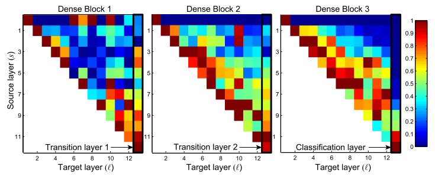

Figure 5 shows a heat-map for all three dense blocks. The average absolute weight serves as a surrogate for the dependency of a convolutional layer on its preceding layers. A red dot in position $ (l, s)$ indicates that the layer $l$ makes, on average, strong use of feature-maps produced s-layers before. Several observations can be made from the plot:

1. All layers spread their weights over many inputs within the same block. This indicates that features extracted by very early layers are, indeed, directly used by deep layers throughout the same dense block.

2. The weights of the transition layers also spread their weight across all layers within the preceding dense block, indicating information flow from the first to the last layers of the DenseNet through few indirections.
3. The layers within the second and third dense block consistently assign the least weight to the outputs of the transition layer (the top row of the triangles), indicating that the transition layer outputs many redundant features (with low weight on average). This is in keeping with the strong results of DenseNet-BC where exactly these outputs are compressed.
4. Although the final classification layer, shown on the very right, also uses weights across the entire dense block, there seems to be a concentration towards final feature-maps, suggesting that there may be some more high-level features produced late in the network.


-----

## NASNet


```python
keras.applications.nasnet.NASNetLarge(input_shape=None, include_top=True, weights='imagenet', input_tensor=None, pooling=None, classes=1000)
keras.applications.nasnet.NASNetMobile(input_shape=None, include_top=True, weights='imagenet', input_tensor=None, pooling=None, classes=1000)
```

在 ImageNet 上预训练的神经结构搜索网络模型（NASNet）。

NASNetLarge 模型默认的输入尺寸是 331x331，NASNetMobile 模型默认的输入尺寸是 224x224。

### 参数

- __input_shape__: 可选，输入尺寸元组，仅当 `include_top=False` 时有效，否则对于 NASNetMobile 模型来说，输入形状必须是 `(224, 224, 3)`（`channels_last` 格式）或 `(3, 224, 224)`（`channels_first` 格式），对于 NASNetLarge 来说，输入形状必须是 `(331, 331, 3)` （`channels_last` 格式）或 `(3, 331, 331)`（`channels_first` 格式）。它必须为 3 个输入通道，且宽高必须不小于 32，比如 `(200, 200, 3)` 是一个合法的输入尺寸。
- __include_top__: 是否包括顶层的全连接层。
- __weights__: `None` 代表随机初始化， `'imagenet'` 代表加载在 ImageNet 上预训练的权值。
- __input_tensor__: 可选，Keras tensor 作为模型的输入（比如 `layers.Input()` 输出的 tensor）。
- __pooling__: 可选，当 `include_top` 为 `False` 时，该参数指定了特征提取时的池化方式。
    - `None` 代表不池化，直接输出最后一层卷积层的输出，该输出是一个四维张量。
    - `'avg'` 代表全局平均池化（GlobalAveragePooling2D），相当于在最后一层卷积层后面再加一层全局平均池化层，输出是一个二维张量。
    - `'max'` 代表全局最大池化
- __classes__: 可选，图片分类的类别数，仅当 `include_top` 为 `True` 并且不加载预训练权值时可用。

### 返回

一个 Keras `Model` 实例。

### 参考文献

- [Learning Transferable Architectures for Scalable Image Recognition](https://arxiv.org/abs/1707.07012)

### License

预训练权值基于 [Apache License](https://github.com/tensorflow/models/blob/master/LICENSE)。


## MobileNetV2


```python
keras.applications.mobilenet_v2.MobileNetV2(input_shape=None, alpha=1.0, depth_multiplier=1, include_top=True, weights='imagenet', input_tensor=None, pooling=None, classes=1000)
```

在 ImageNet 上预训练的 MobileNetV2 模型。

请注意，该模型仅支持 `'channels_last'` 数据格式（高度，宽度，通道)。

模型默认输出尺寸为 224x224。

### 参数

- __input_shape__: optional shape tuple, to be specified if you would
    like to use a model with an input img resolution that is not
    (224, 224, 3).
    It should have exactly 3 inputs channels (224, 224, 3).
    You can also omit this option if you would like
    to infer input_shape from an input_tensor.
    If you choose to include both input_tensor and input_shape then
    input_shape will be used if they match, if the shapes
    do not match then we will throw an error.
    E.g. `(160, 160, 3)` would be one valid value.
- __alpha__: 控制网络的宽度。这在 MobileNetV2 论文中被称作宽度乘子。
    - 如果 `alpha` < 1.0，则同比例减少每层的滤波器个数。
    - 如果 `alpha` > 1.0，则同比例增加每层的滤波器个数。
    - 如果 `alpha` = 1，使用论文默认的滤波器个数。
- __depth_multiplier__: depthwise 卷积的深度乘子，也称为（分辨率乘子）
- __include_top__: 是否包括顶层的全连接层。
- __weights__: `None` 代表随机初始化，`'imagenet'` 代表加载在 ImageNet 上预训练的权值。
- __input_tensor__: 可选，Keras tensor 作为模型的输入（即 `layers.Input()` 输出的 tensor）。
- __pooling__: 可选，当 `include_top` 为 `False` 时，该参数指定了特征提取时的池化方式。
    - `None` 代表不池化，直接输出最后一层卷积层的输出，该输出是一个四维张量。
    - `'avg'` 代表全局平均池化（GlobalAveragePooling2D），相当于在最后一层卷积层后面再加一层全局平均池化层，输出是一个二维张量。
    - `'max'` 代表全局最大池化
- __classes__: 可选，图片分类的类别数，仅当 `include_top` 为 `True` 并且不加载预训练权值时可用。

### 返回

一个 Keras `model` 实例。

### 异常

__ValueError__: 如果 `weights` 参数非法，或非法的输入尺寸，或者当 weights='imagenet' 时，非法的 depth_multiplier, alpha, rows。

### 参考文献

- [MobileNetV2: Inverted Residuals and Linear Bottlenecks](https://arxiv.org/abs/1801.04381)

### License

预训练权值基于 [Apache License](https://github.com/tensorflow/models/blob/master/LICENSE).


## 模型应用

Keras 的应用模块（keras.applications）提供了带有预训练权值的深度学习模型，这些模型可以用来进行预测、特征提取和微调（fine-tuning）。

当你初始化一个预训练模型时，会自动下载权重到 `~/.keras/models/` 目录下。

## 可用的模型

### 在 ImageNet 上预训练过的用于图像分类的模型：

- [Xception](#xception)
- [VGG16](#vgg16)
- [VGG19](#vgg19)
- [ResNet, ResNetV2, ResNeXt](#resnet)
- [InceptionV3](#inceptionv3)
- [InceptionResNetV2](#inceptionresnetv2)
- [MobileNet](#mobilenet)
- [MobileNetV2](#mobilenetv2)
- [DenseNet](#densenet)
- [NASNet](#nasnet)

所有的这些架构都兼容所有的后端 (TensorFlow, Theano 和 CNTK)，并且会在实例化时，根据 Keras 配置文件`〜/.keras/keras.json` 中设置的图像数据格式构建模型。举个例子，如果你设置 `image_data_format=channels_last`，则加载的模型将按照 TensorFlow 的维度顺序来构造，即「高度-宽度-深度」（Height-Width-Depth）的顺序。

注意：

- 对于 `Keras < 2.2.0`，Xception 模型仅适用于 TensorFlow，因为它依赖于 `SeparableConvolution` 层。
- 对于 `Keras < 2.1.5`，MobileNet 模型仅适用于 TensorFlow，因为它依赖于 `DepthwiseConvolution` 层。

------

## 图像分类模型的使用示例

### 使用 ResNet50 进行 ImageNet 分类

```python
from keras.applications.resnet50 import ResNet50
from keras.preprocessing import image
from keras.applications.resnet50 import preprocess_input, decode_predictions
import numpy as np

model = ResNet50(weights='imagenet')

img_path = 'elephant.jpg'
img = image.load_img(img_path, target_size=(224, 224))
x = image.img_to_array(img)
x = np.expand_dims(x, axis=0)
x = preprocess_input(x)

preds = model.predict(x)
# 将结果解码为元组列表 (class, description, probability)
# (一个列表代表批次中的一个样本）
print('Predicted:', decode_predictions(preds, top=3)[0])
# Predicted: [(u'n02504013', u'Indian_elephant', 0.82658225), (u'n01871265', u'tusker', 0.1122357), (u'n02504458', u'African_elephant', 0.061040461)]
```

### 使用 VGG16 提取特征

```python
from keras.applications.vgg16 import VGG16
from keras.preprocessing import image
from keras.applications.vgg16 import preprocess_input
import numpy as np

model = VGG16(weights='imagenet', include_top=False)

img_path = 'elephant.jpg'
img = image.load_img(img_path, target_size=(224, 224))
x = image.img_to_array(img)
x = np.expand_dims(x, axis=0)
x = preprocess_input(x)

features = model.predict(x)
```

### 从VGG19 的任意中间层中抽取特征

```python
from keras.applications.vgg19 import VGG19
from keras.preprocessing import image
from keras.applications.vgg19 import preprocess_input
from keras.models import Model
import numpy as np

base_model = VGG19(weights='imagenet')
model = Model(inputs=base_model.input,
              outputs=base_model.get_layer('block4_pool').output)

img_path = 'elephant.jpg'
img = image.load_img(img_path, target_size=(224, 224))
x = image.img_to_array(img)
x = np.expand_dims(x, axis=0)
x = preprocess_input(x)

block4_pool_features = model.predict(x)
```

### 在新类上微调 InceptionV3

```python
from keras.applications.inception_v3 import InceptionV3
from keras.preprocessing import image
from keras.models import Model
from keras.layers import Dense, GlobalAveragePooling2D
from keras import backend as K

# 构建不带分类器的预训练模型
base_model = InceptionV3(weights='imagenet', include_top=False)

# 添加全局平均池化层
x = base_model.output
x = GlobalAveragePooling2D()(x)

# 添加一个全连接层
x = Dense(1024, activation='relu')(x)

# 添加一个分类器，假设我们有200个类
predictions = Dense(200, activation='softmax')(x)

# 构建我们需要训练的完整模型
model = Model(inputs=base_model.input, outputs=predictions)

# 首先，我们只训练顶部的几层（随机初始化的层）
# 锁住所有 InceptionV3 的卷积层
for layer in base_model.layers:
    layer.trainable = False

# 编译模型（一定要在锁层以后操作）
model.compile(optimizer='rmsprop', loss='categorical_crossentropy')

# 在新的数据集上训练几代
model.fit_generator(...)

# 现在顶层应该训练好了，让我们开始微调 Inception V3 的卷积层。
# 我们会锁住底下的几层，然后训练其余的顶层。

# 让我们看看每一层的名字和层号，看看我们应该锁多少层呢：
for i, layer in enumerate(base_model.layers):
   print(i, layer.name)

# 我们选择训练最上面的两个 Inception block
# 也就是说锁住前面249层，然后放开之后的层。
for layer in model.layers[:249]:
   layer.trainable = False
for layer in model.layers[249:]:
   layer.trainable = True

# 我们需要重新编译模型，才能使上面的修改生效
# 让我们设置一个很低的学习率，使用 SGD 来微调
from keras.optimizers import SGD
model.compile(optimizer=SGD(lr=0.0001, momentum=0.9), loss='categorical_crossentropy')

# 我们继续训练模型，这次我们训练最后两个 Inception block
# 和两个全连接层
model.fit_generator(...)
```

### 通过自定义输入张量构建 InceptionV3

```python
from keras.applications.inception_v3 import InceptionV3
from keras.layers import Input

# 这也可能是不同的 Keras 模型或层的输出
input_tensor = Input(shape=(224, 224, 3))  # 假定 K.image_data_format() == 'channels_last'

model = InceptionV3(input_tensor=input_tensor, weights='imagenet', include_top=True)
```

------

